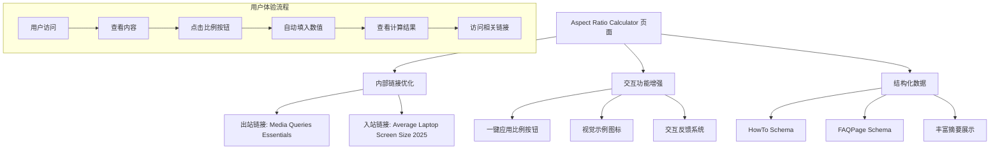
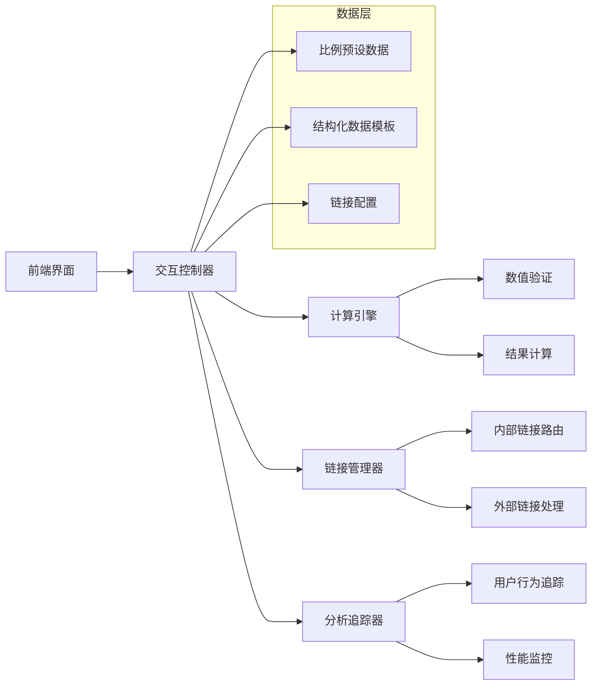

# Aspect Ratio Calculator 页面优化设计文档

## 概述

本设计文档基于"The Polish - 如何从95分到99分"的优化建议，提供了针对 Aspect Ratio Calculator 页面的精细化优化方案。设计重点关注内部链接策略、交互功能增强、视觉体验提升和结构化数据实现，旨在通过细节优化将页面体验从优秀提升到卓越。

## 架构设计

### 优化策略架构



### 技术实现架构



## 组件和接口设计

### 1. 内部链接管理系统

#### InternalLinkManager 类
```javascript
class InternalLinkManager {
    constructor() {
        this.linkConfig = {
            outbound: {
                'responsive-design': {
                    target: '/blog/media-queries-essentials/',
                    context: 'Why Aspect Ratio Matters',
                    anchorText: 'responsive web design',
                    openInNewTab: true
                }
            },
            inbound: {
                'aspect-ratio': {
                    source: '/blog/average-laptop-screen-size-2025/',
                    section: 'Understanding Key Terms',
                    anchorText: 'Aspect Ratio',
                    target: '/tools/aspect-ratio-calculator/'
                }
            }
        };
        
        this.analytics = new LinkAnalytics();
    }
    
    // 初始化链接系统
    initialize() {
        this.setupOutboundLinks();
        this.setupInboundLinkTracking();
        this.setupLinkPreview();
    }
    
    // 设置出站链接
    setupOutboundLinks() {
        const responsiveDesignElements = document.querySelectorAll(
            '.aspect-ratio-content p, .why-aspect-ratio-matters p'
        );
        
        responsiveDesignElements.forEach(element => {
            const text = element.innerHTML;
            const updatedText = text.replace(
                /responsive web design/gi,
                '<a href="/blog/media-queries-essentials/" target="_blank" rel="noopener" class="internal-link" data-link-type="outbound" data-link-id="responsive-design">responsive web design</a>'
            );
            
            if (updatedText !== text) {
                element.innerHTML = updatedText;
                this.analytics.trackLinkCreation('outbound', 'responsive-design');
            }
        });
    }
    
    // 设置入站链接追踪
    setupInboundLinkTracking() {
        // 检查是否从博客文章访问
        const referrer = document.referrer;
        const urlParams = new URLSearchParams(window.location.search);
        
        if (referrer.includes('/blog/average-laptop-screen-size-2025/') || 
            urlParams.get('from') === 'laptop-screen-size') {
            this.analytics.trackInboundVisit('laptop-screen-size');
            this.showReferralContext();
        }
    }
    
    // 显示来源上下文
    showReferralContext() {
        const contextBanner = document.createElement('div');
        contextBanner.className = 'referral-context';
        contextBanner.innerHTML = `
            <div class="context-message">
                <span class="context-icon">🔗</span>
                <span class="context-text">来自《Average Laptop Screen Size 2025》文章</span>
                <button class="context-close" onclick="this.parentElement.parentElement.remove()">×</button>
            </div>
        `;
        
        const calculator = document.querySelector('.aspect-ratio-calculator');
        if (calculator) {
            calculator.insertBefore(contextBanner, calculator.firstChild);
        }
    }
    
    // 设置链接预览
    setupLinkPreview() {
        const links = document.querySelectorAll('.internal-link');
        
        links.forEach(link => {
            link.addEventListener('mouseenter', (e) => {
                this.showLinkPreview(e.target);
            });
            
            link.addEventListener('mouseleave', () => {
                this.hideLinkPreview();
            });
            
            link.addEventListener('click', (e) => {
                this.analytics.trackLinkClick(
                    e.target.dataset.linkType,
                    e.target.dataset.linkId
                );
            });
        });
    }
    
    // 显示链接预览
    showLinkPreview(linkElement) {
        const preview = document.createElement('div');
        preview.className = 'link-preview';
        preview.innerHTML = `
            <div class="preview-content">
                <h4>Media Queries Essentials</h4>
                <p>深入了解响应式设计中的媒体查询技术...</p>
                <span class="preview-url">/blog/media-queries-essentials/</span>
            </div>
        `;
        
        document.body.appendChild(preview);
        
        const rect = linkElement.getBoundingClientRect();
        preview.style.left = `${rect.left}px`;
        preview.style.top = `${rect.bottom + 10}px`;
    }
    
    // 隐藏链接预览
    hideLinkPreview() {
        const preview = document.querySelector('.link-preview');
        if (preview) {
            preview.remove();
        }
    }
}
```

### 2. 交互式比例选择系统

#### AspectRatioSelector 类
```javascript
class AspectRatioSelector {
    constructor(calculatorInstance) {
        this.calculator = calculatorInstance;
        this.commonRatios = [
            { ratio: '16:9', width: 16, height: 9, name: '宽屏显示器', description: '最常见的现代显示器比例' },
            { ratio: '4:3', width: 4, height: 3, name: '传统显示器', description: '经典的计算机显示器比例' },
            { ratio: '21:9', width: 21, height: 9, name: '超宽屏', description: '电影院和游戏显示器' },
            { ratio: '1:1', width: 1, height: 1, name: '正方形', description: '社交媒体头像常用' },
            { ratio: '3:2', width: 3, height: 2, name: '摄影标准', description: '传统摄影和印刷' },
            { ratio: '5:4', width: 5, height: 4, name: '老式显示器', description: '早期 CRT 显示器' }
        ];
        
        this.analytics = new InteractionAnalytics();
    }
    
    // 初始化比例选择器
    initialize() {
        this.renderRatioButtons();
        this.renderVisualExamples();
        this.setupEventListeners();
    }
    
    // 渲染比例按钮
    renderRatioButtons() {
        const ratioSection = document.querySelector('.common-ratios-section');
        if (!ratioSection) return;
        
        const ratioList = ratioSection.querySelector('.ratio-list') || 
                         this.createRatioList(ratioSection);
        
        this.commonRatios.forEach(ratioData => {
            const ratioItem = this.createRatioItem(ratioData);
            ratioList.appendChild(ratioItem);
        });
    }
    
    // 创建比例列表容器
    createRatioList(parentSection) {
        const ratioList = document.createElement('div');
        ratioList.className = 'ratio-list';
        parentSection.appendChild(ratioList);
        return ratioList;
    }
    
    // 创建单个比例项
    createRatioItem(ratioData) {
        const ratioItem = document.createElement('div');
        ratioItem.className = 'ratio-item';
        ratioItem.innerHTML = `
            <div class="ratio-visual">
                ${this.createVisualExample(ratioData)}
            </div>
            <div class="ratio-info">
                <h4 class="ratio-title">${ratioData.ratio} - ${ratioData.name}</h4>
                <p class="ratio-description">${ratioData.description}</p>
                <button class="use-ratio-btn" 
                        data-width="${ratioData.width}" 
                        data-height="${ratioData.height}"
                        data-ratio="${ratioData.ratio}">
                    <span class="btn-icon">⚡</span>
                    <span class="btn-text">使用此比例</span>
                </button>
            </div>
        `;
        
        return ratioItem;
    }
    
    // 创建视觉示例
    createVisualExample(ratioData) {
        const aspectRatio = ratioData.width / ratioData.height;
        const baseWidth = 60;
        const height = baseWidth / aspectRatio;
        
        return `
            <svg class="ratio-shape" width="80" height="60" viewBox="0 0 80 60">
                <rect x="${(80 - baseWidth) / 2}" 
                      y="${(60 - height) / 2}" 
                      width="${baseWidth}" 
                      height="${height}" 
                      fill="var(--primary-color)" 
                      stroke="var(--border-color)" 
                      stroke-width="1"
                      rx="2"/>
                <text x="40" y="35" 
                      text-anchor="middle" 
                      font-size="8" 
                      fill="white">${ratioData.ratio}</text>
            </svg>
        `;
    }
    
    // 设置事件监听器
    setupEventListeners() {
        document.addEventListener('click', (e) => {
            if (e.target.closest('.use-ratio-btn')) {
                this.handleRatioSelection(e.target.closest('.use-ratio-btn'));
            }
        });
        
        // 键盘支持
        document.addEventListener('keydown', (e) => {
            if (e.key === 'Enter' && e.target.classList.contains('use-ratio-btn')) {
                this.handleRatioSelection(e.target);
            }
        });
    }
    
    // 处理比例选择
    handleRatioSelection(button) {
        const width = parseInt(button.dataset.width);
        const height = parseInt(button.dataset.height);
        const ratio = button.dataset.ratio;
        
        // 添加视觉反馈
        this.showSelectionFeedback(button);
        
        // 填入计算器
        this.fillCalculatorInputs(width, height);
        
        // 记录分析数据
        this.analytics.trackRatioSelection(ratio);
        
        // 滚动到计算器
        this.scrollToCalculator();
    }
    
    // 显示选择反馈
    showSelectionFeedback(button) {
        button.classList.add('selected');
        
        // 创建成功提示
        const feedback = document.createElement('div');
        feedback.className = 'selection-feedback';
        feedback.textContent = '✓ 已应用';
        
        button.appendChild(feedback);
        
        setTimeout(() => {
            button.classList.remove('selected');
            feedback.remove();
        }, 2000);
    }
    
    // 填入计算器输入框
    fillCalculatorInputs(width, height) {
        const widthInput = document.querySelector('#original-width, [name="width"]');
        const heightInput = document.querySelector('#original-height, [name="height"]');
        
        if (widthInput && heightInput) {
            // 添加高亮效果
            widthInput.classList.add('auto-filled');
            heightInput.classList.add('auto-filled');
            
            // 填入数值
            widthInput.value = width;
            heightInput.value = height;
            
            // 触发计算
            if (this.calculator && this.calculator.calculate) {
                this.calculator.calculate();
            } else {
                // 触发 input 事件以启动计算
                widthInput.dispatchEvent(new Event('input', { bubbles: true }));
            }
            
            // 移除高亮效果
            setTimeout(() => {
                widthInput.classList.remove('auto-filled');
                heightInput.classList.remove('auto-filled');
            }, 3000);
        }
    }
    
    // 滚动到计算器
    scrollToCalculator() {
        const calculator = document.querySelector('.aspect-ratio-calculator, .calculator-section');
        if (calculator) {
            calculator.scrollIntoView({ 
                behavior: 'smooth', 
                block: 'center' 
            });
        }
    }
}
```

### 3. 结构化数据管理系统

#### StructuredDataManager 类
```javascript
class StructuredDataManager {
    constructor() {
        this.schemas = {
            howTo: this.createHowToSchema(),
            faqPage: this.createFAQPageSchema()
        };
    }
    
    // 初始化结构化数据
    initialize() {
        this.injectSchemas();
        this.validateSchemas();
    }
    
    // 创建 HowTo 结构化数据
    createHowToSchema() {
        return {
            "@context": "https://schema.org",
            "@type": "HowTo",
            "name": "如何使用宽高比计算器",
            "description": "学习如何使用在线宽高比计算器来计算和转换不同的屏幕比例",
            "image": {
                "@type": "ImageObject",
                "url": "https://screensize.cc/images/aspect-ratio-calculator-guide.jpg",
                "width": 1200,
                "height": 630
            },
            "totalTime": "PT2M",
            "estimatedCost": {
                "@type": "MonetaryAmount",
                "currency": "USD",
                "value": "0"
            },
            "supply": [
                {
                    "@type": "HowToSupply",
                    "name": "网络浏览器"
                },
                {
                    "@type": "HowToSupply", 
                    "name": "设备尺寸数据"
                }
            ],
            "tool": [
                {
                    "@type": "HowToTool",
                    "name": "宽高比计算器"
                }
            ],
            "step": [
                {
                    "@type": "HowToStep",
                    "name": "输入原始尺寸",
                    "text": "在宽度和高度输入框中输入您的原始尺寸数值",
                    "image": {
                        "@type": "ImageObject",
                        "url": "https://screensize.cc/images/step1-input-dimensions.jpg"
                    },
                    "url": "https://screensize.cc/tools/aspect-ratio-calculator/#step1"
                },
                {
                    "@type": "HowToStep",
                    "name": "选择目标尺寸",
                    "text": "输入您希望转换到的新宽度或高度",
                    "image": {
                        "@type": "ImageObject",
                        "url": "https://screensize.cc/images/step2-target-size.jpg"
                    },
                    "url": "https://screensize.cc/tools/aspect-ratio-calculator/#step2"
                },
                {
                    "@type": "HowToStep",
                    "name": "获取计算结果",
                    "text": "系统将自动计算并显示保持相同宽高比的对应尺寸",
                    "image": {
                        "@type": "ImageObject",
                        "url": "https://screensize.cc/images/step3-get-result.jpg"
                    },
                    "url": "https://screensize.cc/tools/aspect-ratio-calculator/#step3"
                },
                {
                    "@type": "HowToStep",
                    "name": "使用预设比例",
                    "text": "点击常见比例按钮快速应用 16:9、4:3 等标准比例",
                    "image": {
                        "@type": "ImageObject",
                        "url": "https://screensize.cc/images/step4-preset-ratios.jpg"
                    },
                    "url": "https://screensize.cc/tools/aspect-ratio-calculator/#step4"
                }
            ]
        };
    }
    
    // 创建 FAQPage 结构化数据
    createFAQPageSchema() {
        return {
            "@context": "https://schema.org",
            "@type": "FAQPage",
            "mainEntity": [
                {
                    "@type": "Question",
                    "name": "什么是宽高比？",
                    "acceptedAnswer": {
                        "@type": "Answer",
                        "text": "宽高比是指图像、屏幕或显示器的宽度与高度的比例关系。它通常用两个数字表示，如 16:9，表示宽度是高度的 16/9 倍。宽高比在响应式网页设计、视频制作和显示器选择中都非常重要。"
                    }
                },
                {
                    "@type": "Question",
                    "name": "最常见的宽高比有哪些？",
                    "acceptedAnswer": {
                        "@type": "Answer",
                        "text": "最常见的宽高比包括：16:9（现代显示器和电视）、4:3（传统显示器）、21:9（超宽屏显示器）、1:1（正方形，常用于社交媒体）、3:2（摄影标准）和 5:4（老式显示器）。每种比例都有其特定的应用场景。"
                    }
                },
                {
                    "@type": "Question",
                    "name": "如何计算宽高比？",
                    "acceptedAnswer": {
                        "@type": "Answer",
                        "text": "计算宽高比的方法是将宽度除以高度。例如，1920x1080 的分辨率，宽高比为 1920÷1080 = 1.78，约等于 16:9。您也可以使用我们的在线计算器，只需输入尺寸即可自动计算。"
                    }
                },
                {
                    "@type": "Question",
                    "name": "为什么宽高比在网页设计中很重要？",
                    "acceptedAnswer": {
                        "@type": "Answer",
                        "text": "宽高比在网页设计中至关重要，因为它影响内容在不同设备上的显示效果。正确的宽高比可以确保图像不变形、布局保持美观、响应式设计正常工作。这对用户体验和 SEO 都有积极影响。"
                    }
                },
                {
                    "@type": "Question",
                    "name": "如何在保持宽高比的同时调整图像尺寸？",
                    "acceptedAnswer": {
                        "@type": "Answer",
                        "text": "要在保持宽高比的同时调整图像尺寸，您需要按比例缩放宽度和高度。使用我们的计算器，输入原始尺寸和目标宽度（或高度），系统会自动计算出对应的高度（或宽度），确保比例不变。"
                    }
                },
                {
                    "@type": "Question",
                    "name": "移动设备和桌面设备的宽高比有什么区别？",
                    "acceptedAnswer": {
                        "@type": "Answer",
                        "text": "移动设备通常使用竖屏比例，如 9:16 或 9:18，而桌面设备多使用横屏比例，如 16:9 或 16:10。在响应式设计中，需要考虑这些差异，确保内容在不同设备上都能良好显示。"
                    }
                }
            ]
        };
    }
    
    // 注入结构化数据
    injectSchemas() {
        Object.entries(this.schemas).forEach(([type, schema]) => {
            const script = document.createElement('script');
            script.type = 'application/ld+json';
            script.textContent = JSON.stringify(schema, null, 2);
            script.setAttribute('data-schema-type', type);
            document.head.appendChild(script);
        });
    }
    
    // 验证结构化数据
    validateSchemas() {
        // 在开发环境中验证结构化数据
        if (window.location.hostname === 'localhost' || 
            window.location.hostname.includes('dev')) {
            this.performValidation();
        }
    }
    
    // 执行验证
    performValidation() {
        console.group('结构化数据验证');
        
        Object.entries(this.schemas).forEach(([type, schema]) => {
            console.log(`${type} Schema:`, schema);
            
            // 基本验证
            if (schema['@context'] && schema['@type']) {
                console.log(`✓ ${type} schema 格式正确`);
            } else {
                console.error(`✗ ${type} schema 格式错误`);
            }
        });
        
        console.log('建议使用 Google Rich Results Test 进行完整验证：');
        console.log('https://search.google.com/test/rich-results');
        console.groupEnd();
    }
}
```

### 4. 分析和监控系统

#### OptimizationAnalytics 类
```javascript
class OptimizationAnalytics {
    constructor() {
        this.events = [];
        this.sessionData = {
            startTime: Date.now(),
            pageViews: 0,
            interactions: 0,
            linkClicks: 0,
            ratioSelections: 0
        };
        
        this.performanceMetrics = {
            loadTime: 0,
            interactionTime: 0,
            linkClickRate: 0,
            ratioUsageRate: 0
        };
    }
    
    // 初始化分析系统
    initialize() {
        this.trackPageLoad();
        this.setupPerformanceMonitoring();
        this.setupUserBehaviorTracking();
        this.startSessionTracking();
    }
    
    // 跟踪页面加载
    trackPageLoad() {
        window.addEventListener('load', () => {
            this.performanceMetrics.loadTime = performance.now();
            this.trackEvent('page_load', {
                loadTime: this.performanceMetrics.loadTime,
                timestamp: Date.now()
            });
        });
    }
    
    // 设置性能监控
    setupPerformanceMonitoring() {
        // 监控 Core Web Vitals
        if ('PerformanceObserver' in window) {
            const observer = new PerformanceObserver((list) => {
                for (const entry of list.getEntries()) {
                    this.trackWebVital(entry);
                }
            });
            
            observer.observe({ entryTypes: ['largest-contentful-paint', 'first-input', 'layout-shift'] });
        }
    }
    
    // 跟踪 Web Vitals
    trackWebVital(entry) {
        const metric = {
            name: entry.entryType,
            value: entry.value || entry.processingStart - entry.startTime,
            timestamp: Date.now()
        };
        
        this.trackEvent('web_vital', metric);
    }
    
    // 设置用户行为跟踪
    setupUserBehaviorTracking() {
        // 跟踪滚动行为
        let scrollDepth = 0;
        window.addEventListener('scroll', () => {
            const currentDepth = Math.round((window.scrollY / (document.body.scrollHeight - window.innerHeight)) * 100);
            if (currentDepth > scrollDepth && currentDepth % 25 === 0) {
                scrollDepth = currentDepth;
                this.trackEvent('scroll_depth', { depth: scrollDepth });
            }
        });
        
        // 跟踪页面停留时间
        let startTime = Date.now();
        window.addEventListener('beforeunload', () => {
            const timeOnPage = Date.now() - startTime;
            this.trackEvent('time_on_page', { duration: timeOnPage });
        });
    }
    
    // 跟踪链接点击
    trackLinkClick(linkType, linkId) {
        this.sessionData.linkClicks++;
        this.trackEvent('link_click', {
            type: linkType,
            id: linkId,
            timestamp: Date.now()
        });
    }
    
    // 跟踪比例选择
    trackRatioSelection(ratio) {
        this.sessionData.ratioSelections++;
        this.trackEvent('ratio_selection', {
            ratio: ratio,
            timestamp: Date.now()
        });
    }
    
    // 跟踪事件
    trackEvent(eventName, eventData) {
        const event = {
            name: eventName,
            data: eventData,
            timestamp: Date.now(),
            sessionId: this.getSessionId()
        };
        
        this.events.push(event);
        
        // 发送到分析服务
        this.sendToAnalytics(event);
    }
    
    // 发送到分析服务
    sendToAnalytics(event) {
        // 使用 Google Analytics 4
        if (typeof gtag !== 'undefined') {
            gtag('event', event.name, {
                custom_parameter_1: JSON.stringify(event.data),
                event_category: 'aspect_ratio_optimization',
                event_label: event.name
            });
        }
        
        // 发送到自定义分析端点
        if (navigator.sendBeacon) {
            const data = JSON.stringify(event);
            navigator.sendBeacon('/api/analytics', data);
        }
    }
    
    // 获取会话ID
    getSessionId() {
        let sessionId = sessionStorage.getItem('analytics_session_id');
        if (!sessionId) {
            sessionId = 'session_' + Date.now() + '_' + Math.random().toString(36).substr(2, 9);
            sessionStorage.setItem('analytics_session_id', sessionId);
        }
        return sessionId;
    }
    
    // 生成优化报告
    generateOptimizationReport() {
        const report = {
            sessionData: this.sessionData,
            performanceMetrics: this.performanceMetrics,
            events: this.events,
            insights: this.generateInsights()
        };
        
        return report;
    }
    
    // 生成洞察
    generateInsights() {
        const insights = [];
        
        // 链接点击率分析
        if (this.sessionData.linkClicks > 0) {
            insights.push({
                type: 'link_performance',
                message: `用户点击了 ${this.sessionData.linkClicks} 个内部链接`,
                recommendation: '内部链接策略有效，建议继续优化'
            });
        }
        
        // 比例使用率分析
        if (this.sessionData.ratioSelections > 0) {
            insights.push({
                type: 'ratio_usage',
                message: `用户使用了 ${this.sessionData.ratioSelections} 次预设比例`,
                recommendation: '一键应用功能受欢迎，可考虑添加更多预设'
            });
        }
        
        return insights;
    }
}
```

## 数据模型

### 链接配置数据模型
```javascript
class LinkConfigModel {
    constructor() {
        this.outboundLinks = [
            {
                id: 'responsive-design',
                sourceContext: 'Why Aspect Ratio Matters',
                anchorText: 'responsive web design',
                targetUrl: '/blog/media-queries-essentials/',
                openInNewTab: true,
                trackingEnabled: true
            }
        ];
        
        this.inboundLinks = [
            {
                id: 'aspect-ratio-term',
                sourceUrl: '/blog/average-laptop-screen-size-2025/',
                sourceSection: 'Understanding Key Terms',
                anchorText: 'Aspect Ratio',
                targetUrl: '/tools/aspect-ratio-calculator/',
                expectedTraffic: 'medium'
            }
        ];
        
        this.linkMetrics = {
            clickThroughRate: 0,
            conversionRate: 0,
            bounceRate: 0,
            timeOnTarget: 0
        };
    }
}
```

### 比例数据模型
```javascript
class AspectRatioModel {
    constructor() {
        this.commonRatios = [
            {
                id: '16-9',
                ratio: '16:9',
                decimal: 1.778,
                width: 16,
                height: 9,
                name: '宽屏显示器',
                description: '最常见的现代显示器比例',
                category: 'display',
                popularity: 'high',
                useCases: ['显示器', '电视', '笔记本电脑']
            },
            {
                id: '4-3',
                ratio: '4:3',
                decimal: 1.333,
                width: 4,
                height: 3,
                name: '传统显示器',
                description: '经典的计算机显示器比例',
                category: 'display',
                popularity: 'medium',
                useCases: ['老式显示器', '投影仪', '平板电脑']
            }
        ];
        
        this.usageStatistics = {
            mostUsedRatio: '16:9',
            selectionCount: new Map(),
            userPreferences: new Map()
        };
    }
    
    // 获取比例信息
    getRatioById(id) {
        return this.commonRatios.find(ratio => ratio.id === id);
    }
    
    // 记录使用统计
    recordUsage(ratioId) {
        const currentCount = this.usageStatistics.selectionCount.get(ratioId) || 0;
        this.usageStatistics.selectionCount.set(ratioId, currentCount + 1);
    }
    
    // 获取热门比例
    getPopularRatios(limit = 5) {
        return [...this.usageStatistics.selectionCount.entries()]
            .sort((a, b) => b[1] - a[1])
            .slice(0, limit)
            .map(([id]) => this.getRatioById(id));
    }
}
```

## 错误处理

### 优化功能错误处理
```javascript
class OptimizationErrorHandler {
    constructor() {
        this.errorLog = [];
        this.fallbackStrategies = new Map();
        this.setupFallbacks();
    }
    
    // 设置降级策略
    setupFallbacks() {
        this.fallbackStrategies.set('link-creation-failed', () => {
            console.warn('链接创建失败，使用静态文本');
            return 'responsive web design';
        });
        
        this.fallbackStrategies.set('ratio-button-failed', () => {
            console.warn('比例按钮创建失败，显示文本链接');
            return '<span class="ratio-text">点击使用此比例</span>';
        });
        
        this.fallbackStrategies.set('schema-injection-failed', () => {
            console.warn('结构化数据注入失败，跳过 SEO 增强');
            return null;
        });
    }
    
    // 处理错误
    handleError(errorType, error, context = {}) {
        const errorRecord = {
            type: errorType,
            message: error.message,
            stack: error.stack,
            context: context,
            timestamp: Date.now()
        };
        
        this.errorLog.push(errorRecord);
        
        // 执行降级策略
        const fallback = this.fallbackStrategies.get(errorType);
        if (fallback) {
            return fallback();
        }
        
        // 发送错误报告
        this.reportError(errorRecord);
        
        return null;
    }
    
    // 报告错误
    reportError(errorRecord) {
        if (navigator.sendBeacon) {
            const data = JSON.stringify(errorRecord);
            navigator.sendBeacon('/api/errors', data);
        }
    }
}
```

## 测试策略

### A/B 测试配置
```javascript
class ABTestManager {
    constructor() {
        this.tests = {
            'ratio-button-style': {
                variants: ['default', 'highlighted', 'minimal'],
                currentVariant: this.getVariant('ratio-button-style'),
                metrics: ['click_rate', 'conversion_rate']
            },
            'link-preview': {
                variants: ['enabled', 'disabled'],
                currentVariant: this.getVariant('link-preview'),
                metrics: ['hover_rate', 'click_rate']
            }
        };
    }
    
    // 获取用户变体
    getVariant(testName) {
        const userId = this.getUserId();
        const hash = this.hashCode(userId + testName);
        const variants = this.tests[testName].variants;
        return variants[Math.abs(hash) % variants.length];
    }
    
    // 应用测试变体
    applyVariant(testName) {
        const test = this.tests[testName];
        const variant = test.currentVariant;
        
        switch (testName) {
            case 'ratio-button-style':
                document.body.classList.add(`ratio-btn-${variant}`);
                break;
            case 'link-preview':
                if (variant === 'disabled') {
                    document.body.classList.add('no-link-preview');
                }
                break;
        }
    }
}
```

## 部署和监控

### 优化效果监控
```javascript
class OptimizationMonitor {
    constructor() {
        this.baselineMetrics = this.loadBaselineMetrics();
        this.currentMetrics = {};
        this.improvementThresholds = {
            linkClickRate: 0.05, // 5% 提升
            ratioUsageRate: 0.10, // 10% 提升
            pageEngagement: 0.15, // 15% 提升
            searchVisibility: 0.20 // 20% 提升
        };
    }
    
    // 监控优化效果
    monitorOptimizationImpact() {
        this.measureCurrentMetrics();
        this.compareWithBaseline();
        this.generateImpactReport();
    }
    
    // 测量当前指标
    measureCurrentMetrics() {
        this.currentMetrics = {
            linkClickRate: this.calculateLinkClickRate(),
            ratioUsageRate: this.calculateRatioUsageRate(),
            pageEngagement: this.calculatePageEngagement(),
            searchVisibility: this.calculateSearchVisibility()
        };
    }
    
    // 与基线对比
    compareWithBaseline() {
        const improvements = {};
        
        Object.keys(this.currentMetrics).forEach(metric => {
            const current = this.currentMetrics[metric];
            const baseline = this.baselineMetrics[metric] || 0;
            const improvement = (current - baseline) / baseline;
            
            improvements[metric] = {
                current,
                baseline,
                improvement,
                significant: improvement >= this.improvementThresholds[metric]
            };
        });
        
        return improvements;
    }
    
    // 生成影响报告
    generateImpactReport() {
        const improvements = this.compareWithBaseline();
        
        const report = {
            timestamp: Date.now(),
            summary: this.generateSummary(improvements),
            details: improvements,
            recommendations: this.generateRecommendations(improvements)
        };
        
        return report;
    }
}
```

这个设计文档提供了完整的技术实现方案，涵盖了您提出的所有优化建议：内部链接管理、交互式比例选择、结构化数据实现和效果监控。每个组件都有详细的接口设计和实现逻辑。