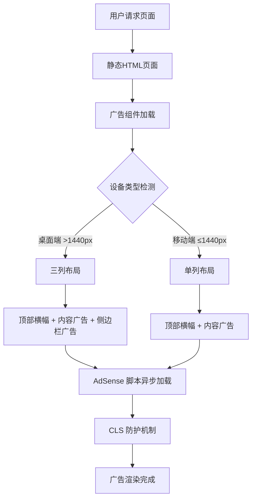

# 高级多平台 AdSense 系统设计文档

## 概述

本设计文档详细描述了为 screensizechecker.com 实现高级多平台 AdSense 系统的技术架构。该系统将完全替换现有的广告实现，通过模块化组件、响应式布局和性能优化来最大化广告收入，同时保持优秀的用户体验和 Core Web Vitals 指标。

## 架构

### 系统架构图



### 核心设计原则

1. **模块化组件架构**：每种广告类型都是独立的可重用组件
2. **响应式优先**：桌面端和移动端采用不同的布局策略
3. **性能优化**：异步加载、CLS 防护、优雅降级
4. **维护友好**：清晰的配置管理和部署流程

## 组件和接口

### 1. 广告组件系统

#### 1.1 顶部横幅广告组件 (`ad-banner-top.html`)

**功能**：页面顶部的响应式横幅广告
**位置**：H1 标题后，所有页面类型通用
**尺寸策略**：自适应宽度，固定最小高度

```html
<!-- 顶部横幅广告单元 -->
<div class="ad-container ad-banner-top">
    <ins class="adsbygoogle"
         style="display:block"
         data-ad-client="ca-pub-9212629010224868"
         data-ad-slot="TOP_BANNER_SLOT_ID"
         data-ad-format="auto"
         data-full-width-responsive="true"></ins>
    <script>
        (adsbygoogle = window.adsbygoogle || []).push({});
    </script>
</div>
```

#### 1.2 内容中矩形广告组件 (`ad-rectangle-in-content.html`)

**功能**：插入内容中的方形/矩形广告
**位置**：工具区域后、博客段落间、文章结尾
**尺寸策略**：响应式矩形，适配移动端和桌面端

```html
<!-- 内容中广告单元 -->
<div class="ad-container ad-rectangle-in-content">
    <ins class="adsbygoogle"
         style="display:block"
         data-ad-client="ca-pub-9212629010224868"
         data-ad-slot="IN_CONTENT_RECTANGLE_SLOT_ID"
         data-ad-format="auto"
         data-full-width-responsive="true"></ins>
    <script>
        (adsbygoogle = window.adsbygoogle || []).push({});
    </script>
</div>
```

#### 1.3 右侧摩天楼广告组件 (`ad-skyscraper-right.html`)

**功能**：桌面端右侧边栏的垂直广告
**位置**：仅在桌面端显示，具有粘性定位
**尺寸策略**：固定宽度 (160-180px)，较高的垂直尺寸

```html
<!-- 右侧摩天楼广告单元 -->
<div class="ad-container ad-skyscraper-right">
    <ins class="adsbygoogle"
         style="display:block"
         data-ad-client="ca-pub-9212629010224868"
         data-ad-slot="SKYSCRAPER_RIGHT_SLOT_ID"
         data-ad-format="auto"
         data-full-width-responsive="true"></ins>
    <script>
        (adsbygoogle = window.adsbygoogle || []).push({});
    </script>
</div>
```

### 2. 布局系统设计

#### 2.1 CSS Grid 三列布局

**桌面端布局结构**：
```css
.main-layout-container {
    display: grid;
    grid-template-columns: 1fr 180px;
    grid-template-areas: 
        "content sidebar";
    gap: var(--spacing-xl);
    max-width: 1200px;
    margin: 0 auto;
}

.main-content-area {
    grid-area: content;
    min-width: 0; /* 防止内容溢出 */
}

.sidebar-right {
    grid-area: sidebar;
    position: sticky;
    top: 84px; /* header高度 + 间距 */
    height: fit-content;
}
```

#### 2.2 响应式断点策略

**断点设计**：
- `> 1440px`：显示完整三列布局（内容 + 右侧边栏）
- `≤ 1440px`：隐藏右侧边栏，只显示内容区域广告
- `≤ 768px`：移动端优化，调整广告尺寸和间距

### 3. CLS 防护系统

#### 3.1 预留空间策略

每种广告类型都有预定义的最小高度，防止布局偏移：

```css
.ad-container {
    position: relative;
    margin: var(--spacing-xl) 0;
    transition: min-height 0.3s ease;
}

.ad-banner-top {
    min-height: 90px;
    width: 100%;
}

.ad-rectangle-in-content {
    min-height: 250px;
    max-width: 336px;
    margin: var(--spacing-xl) auto;
}

.ad-skyscraper-right {
    min-height: 600px;
    width: 160px;
}
```

#### 3.2 加载状态管理

```css
.ad-container::before {
    content: '';
    position: absolute;
    top: 0;
    left: 0;
    right: 0;
    bottom: 0;
    background: var(--background-secondary);
    border: 1px dashed var(--border-color);
    border-radius: var(--radius-sm);
    opacity: 0.5;
    z-index: -1;
}

.ad-container.loaded::before {
    display: none;
}
```

## 数据模型

### 广告配置数据结构

```javascript
const adConfig = {
    client: "ca-pub-9212629010224868",
    slots: {
        topBanner: "TOP_BANNER_SLOT_ID",
        inContentRectangle: "IN_CONTENT_RECTANGLE_SLOT_ID", 
        skyscraperRight: "SKYSCRAPER_RIGHT_SLOT_ID",
        endOfContent: "END_OF_CONTENT_SLOT_ID"
    },
    responsive: {
        desktop: {
            showSidebar: true,
            maxAdsPerPage: 4
        },
        mobile: {
            showSidebar: false,
            maxAdsPerPage: 3
        }
    }
};
```

### 页面类型配置

```javascript
const pageTypeConfig = {
    "tool-pages": {
        positions: ["after-h1", "after-main-tool"],
        maxAds: 2
    },
    "blog-posts": {
        positions: ["after-title", "after-paragraph-2", "at-2/3-mark", "end-of-content"],
        maxAds: 4
    },
    "device-pages": {
        positions: ["after-h1", "after-table"],
        maxAds: 2
    }
};
```

## 错误处理

### 1. 广告加载失败处理

```javascript
// 广告加载超时检测
function setupAdLoadTimeout(adContainer, timeout = 10000) {
    const timer = setTimeout(() => {
        if (!adContainer.querySelector('.adsbygoogle[data-ad-status="filled"]')) {
            adContainer.classList.add('ad-load-failed');
            // 可选：显示备用内容或减小容器高度
        }
    }, timeout);
    
    // 如果广告成功加载，清除定时器
    const observer = new MutationObserver(() => {
        if (adContainer.querySelector('.adsbygoogle[data-ad-status="filled"]')) {
            clearTimeout(timer);
            adContainer.classList.add('ad-loaded');
            observer.disconnect();
        }
    });
    
    observer.observe(adContainer, { childList: true, subtree: true });
}
```

### 2. 脚本加载错误处理

```javascript
// AdSense 脚本加载错误处理
function loadAdSenseScript() {
    return new Promise((resolve, reject) => {
        if (window.adsbygoogle) {
            resolve();
            return;
        }
        
        const script = document.createElement('script');
        script.async = true;
        script.src = 'https://pagead2.googlesyndication.com/pagead/js/adsbygoogle.js?client=ca-pub-9212629010224868';
        script.crossOrigin = 'anonymous';
        
        script.onload = resolve;
        script.onerror = () => {
            console.warn('AdSense script failed to load');
            reject(new Error('AdSense script load failed'));
        };
        
        document.head.appendChild(script);
    });
}
```

## 测试策略

### 1. 单元测试

- **组件渲染测试**：验证每个广告组件正确渲染
- **配置验证测试**：确保广告配置数据格式正确
- **响应式行为测试**：验证不同屏幕尺寸下的布局行为

### 2. 集成测试

- **页面布局测试**：验证广告组件在不同页面类型中的正确位置
- **CLS 测试**：使用 Lighthouse 测量累积布局偏移
- **加载性能测试**：测量广告对页面加载时间的影响

### 3. 用户体验测试

- **视觉回归测试**：确保广告不破坏现有设计
- **交互测试**：验证广告不干扰用户操作
- **可访问性测试**：确保广告符合 WCAG 标准

### 4. 收入优化测试

- **A/B 测试框架**：测试不同广告位置和尺寸的效果
- **加载策略测试**：比较不同加载时机的收入影响
- **设备特定优化测试**：针对不同设备类型优化广告展示

## 性能优化策略

### 1. 异步加载优化

```javascript
// 延迟加载广告，直到用户滚动到附近
const observerOptions = {
    rootMargin: '200px 0px', // 提前200px开始加载
    threshold: 0
};

const adObserver = new IntersectionObserver((entries) => {
    entries.forEach(entry => {
        if (entry.isIntersecting && !entry.target.dataset.loaded) {
            loadAdInContainer(entry.target);
            entry.target.dataset.loaded = 'true';
        }
    });
}, observerOptions);
```

### 2. 资源优先级优化

```html
<!-- 预连接到 AdSense 域名 -->
<link rel="preconnect" href="https://pagead2.googlesyndication.com">
<link rel="preconnect" href="https://googleads.g.doubleclick.net">

<!-- 预加载关键 AdSense 脚本 -->
<link rel="preload" href="https://pagead2.googlesyndication.com/pagead/js/adsbygoogle.js" as="script">
```

### 3. 缓存策略

- **组件缓存**：广告组件 HTML 通过构建系统缓存
- **配置缓存**：广告配置数据本地存储，减少重复请求
- **脚本缓存**：利用浏览器缓存和 CDN 缓存 AdSense 脚本

## 部署和维护

### 1. 部署流程

1. **开发阶段**：在测试环境使用测试广告单元
2. **预发布**：切换到生产广告单元，进行最终测试
3. **发布**：通过构建系统部署到生产环境
4. **监控**：部署后监控广告加载率和收入指标

### 2. 配置管理

```javascript
// 环境特定配置
const adConfig = {
    development: {
        client: "ca-pub-test",
        testMode: true
    },
    production: {
        client: "ca-pub-9212629010224868",
        testMode: false
    }
};
```

### 3. 监控和分析

- **加载成功率监控**：跟踪广告加载失败率
- **性能指标监控**：监控 CLS、LCP 等 Core Web Vitals
- **收入分析**：分析不同位置和设备的广告收入
- **用户体验指标**：监控跳出率、页面停留时间等

## 技术决策和理由

### 1. 为什么选择 CSS Grid 而不是 Flexbox？

- **Grid 优势**：更适合二维布局，能够精确控制侧边栏位置
- **响应式支持**：通过 `grid-template-areas` 轻松实现布局切换
- **浏览器支持**：现代浏览器支持良好，符合项目目标用户群体

### 2. 为什么使用粘性定位而不是固定定位？

- **用户体验**：粘性定位更自然，不会遮挡内容
- **性能**：避免固定定位可能导致的重绘问题
- **响应式友好**：在移动端自动失效，无需额外处理

### 3. 为什么预留固定高度而不是动态调整？

- **CLS 优化**：预留空间是防止布局偏移的最有效方法
- **用户体验**：避免内容跳动，提供更稳定的阅读体验
- **SEO 友好**：良好的 CLS 分数有助于搜索引擎排名

这个设计确保了广告系统既能最大化收入，又能保持优秀的用户体验和技术性能。