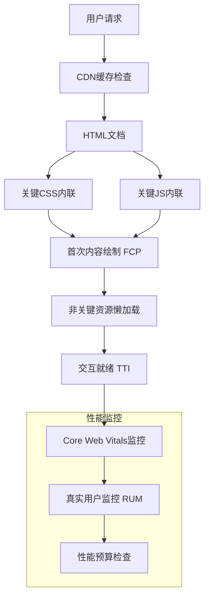

# Google PageSpeed Insights 性能优化设计文档

## 概述

基于Google PageSpeed Insights的性能分析结果，本设计文档提供了针对Screen Size Checker网站的全面性能优化方案。设计重点关注Core Web Vitals指标改善、JavaScript执行优化、CSS渲染性能、移动端体验提升以及资源加载效率。

## 架构设计

### 当前性能瓶颈分析

通过PageSpeed Insights分析，识别出以下主要性能问题：

1. **JavaScript执行阻塞**：12个JS模块同步加载，主线程阻塞时间过长
2. **CSS渲染阻塞**：8个CSS文件阻塞首次内容绘制
3. **资源加载策略**：缺乏关键资源预加载和非关键资源延迟加载
4. **移动端性能**：移动设备上的性能显著低于桌面端
5. **第三方依赖**：i18next、highlight.js等库影响初始加载性能

### 优化架构设计



## 组件和接口设计

### 1. 性能监控核心系统

#### PerformanceMonitor 类
```javascript
class PerformanceMonitor {
    constructor(config = {}) {
        this.config = {
            enableCWV: true,
            enableRUM: true,
            reportingInterval: 30000,
            performanceBudget: {
                LCP: 2500,
                FID: 100,
                CLS: 0.1,
                FCP: 1800,
                TTI: 3800
            },
            ...config
        };
        
        this.metrics = new Map();
        this.observers = new Map();
        this.reportQueue = [];
    }
    
    // 初始化性能监控
    initialize() {
        this.setupCoreWebVitalsMonitoring();
        this.setupResourceTimingMonitoring();
        this.setupLongTaskMonitoring();
        this.setupNavigationTimingMonitoring();
        this.startReporting();
    }
    
    // Core Web Vitals 监控
    setupCoreWebVitalsMonitoring() {
        // LCP 监控
        this.observeLCP();
        // FID 监控
        this.observeFID();
        // CLS 监控
        this.observeCLS();
        // FCP 监控
        this.observeFCP();
        // TTI 监控
        this.observeTTI();
    }
    
    // 长任务监控
    setupLongTaskMonitoring() {
        if ('PerformanceObserver' in window) {
            const observer = new PerformanceObserver((list) => {
                for (const entry of list.getEntries()) {
                    if (entry.duration > 50) {
                        this.recordMetric('long-task', {
                            duration: entry.duration,
                            startTime: entry.startTime,
                            name: entry.name
                        });
                    }
                }
            });
            observer.observe({ entryTypes: ['longtask'] });
        }
    }
    
    // 性能预算检查
    checkPerformanceBudget() {
        const budget = this.config.performanceBudget;
        const violations = [];
        
        for (const [metric, threshold] of Object.entries(budget)) {
            const currentValue = this.getMetric(metric);
            if (currentValue && currentValue > threshold) {
                violations.push({
                    metric,
                    current: currentValue,
                    budget: threshold,
                    violation: currentValue - threshold
                });
            }
        }
        
        return violations;
    }
}
```

### 2. 智能资源加载系统

#### ResourceLoadingOptimizer 类
```javascript
class ResourceLoadingOptimizer {
    constructor() {
        this.criticalResources = new Set([
            'css/base.css',
            'css/main.css',
            'js/app.js',
            'js/device-detector.js'
        ]);
        
        this.deferredResources = new Set([
            'css/blog.css',
            'css/simulator.css',
            'js/blog.js',
            'js/simulator.js',
            'js/ppi-calculator.js'
        ]);
        
        this.loadedResources = new Set();
        this.loadingPromises = new Map();
        this.deviceCapabilities = this.assessDeviceCapabilities();
    }
    
    // 评估设备能力
    assessDeviceCapabilities() {
        const connection = navigator.connection || navigator.mozConnection || navigator.webkitConnection;
        const memory = navigator.deviceMemory || 4;
        const cores = navigator.hardwareConcurrency || 4;
        
        return {
            connectionType: connection?.effectiveType || 'unknown',
            downlink: connection?.downlink || 10,
            memory,
            cores,
            isLowEnd: memory < 4 || cores < 4,
            isSlowConnection: connection?.effectiveType === 'slow-2g' || connection?.effectiveType === '2g'
        };
    }
    
    // 智能预加载策略
    preloadCriticalResources() {
        const preloadPromises = [];
        
        for (const resource of this.criticalResources) {
            if (!this.loadedResources.has(resource)) {
                const promise = this.preloadResource(resource);
                preloadPromises.push(promise);
            }
        }
        
        return Promise.all(preloadPromises);
    }
    
    // 预加载单个资源
    preloadResource(url) {
        if (this.loadingPromises.has(url)) {
            return this.loadingPromises.get(url);
        }
        
        const promise = new Promise((resolve, reject) => {
            const link = document.createElement('link');
            link.rel = 'preload';
            
            // 根据文件类型设置as属性
            if (url.endsWith('.css')) {
                link.as = 'style';
            } else if (url.endsWith('.js')) {
                link.as = 'script';
            } else if (url.match(/\.(jpg|jpeg|png|webp|avif)$/)) {
                link.as = 'image';
            }
            
            link.href = url;
            link.onload = () => {
                this.loadedResources.add(url);
                resolve();
            };
            link.onerror = reject;
            
            document.head.appendChild(link);
        });
        
        this.loadingPromises.set(url, promise);
        return promise;
    }
    
    // 延迟加载非关键资源
    deferNonCriticalResources() {
        // 使用 requestIdleCallback 在浏览器空闲时加载
        if ('requestIdleCallback' in window) {
            requestIdleCallback(() => {
                this.loadDeferredResources();
            }, { timeout: 5000 });
        } else {
            // 降级到 setTimeout
            setTimeout(() => {
                this.loadDeferredResources();
            }, 2000);
        }
    }
    
    // 加载延迟资源
    loadDeferredResources() {
        const loadPromises = [];
        
        for (const resource of this.deferredResources) {
            if (!this.loadedResources.has(resource)) {
                const promise = this.loadResourceAsync(resource);
                loadPromises.push(promise);
            }
        }
        
        return Promise.all(loadPromises);
    }
    
    // 异步加载资源
    loadResourceAsync(url) {
        return new Promise((resolve, reject) => {
            if (url.endsWith('.css')) {
                const link = document.createElement('link');
                link.rel = 'stylesheet';
                link.href = url;
                link.onload = resolve;
                link.onerror = reject;
                document.head.appendChild(link);
            } else if (url.endsWith('.js')) {
                const script = document.createElement('script');
                script.src = url;
                script.async = true;
                script.onload = resolve;
                script.onerror = reject;
                document.head.appendChild(script);
            }
        });
    }
}
```

### 3. JavaScript 性能优化系统

#### ModuleLoadingOptimizer 类
```javascript
class ModuleLoadingOptimizer {
    constructor() {
        this.moduleRegistry = new Map();
        this.loadedModules = new Set();
        this.loadingPromises = new Map();
        this.pageTypeModules = this.definePageTypeModules();
        this.currentPageType = this.detectPageType();
    }
    
    // 定义页面类型对应的模块
    definePageTypeModules() {
        return {
            'home': {
                critical: ['device-detector', 'i18n'],
                deferred: ['clipboard', 'language-modal']
            },
            'devices': {
                critical: ['device-detector', 'i18n'],
                deferred: ['device-comparison', 'ppi-calculator', 'clipboard']
            },
            'blog': {
                critical: ['i18n'],
                deferred: ['blog', 'blog-progress', 'clipboard']
            },
            'calculator': {
                critical: ['device-detector', 'i18n'],
                deferred: ['ppi-calculator', 'aspect-ratio-calculator', 'clipboard']
            }
        };
    }
    
    // 检测当前页面类型
    detectPageType() {
        const path = window.location.pathname;
        
        if (path.includes('/blog/')) return 'blog';
        if (path.includes('/devices/')) return 'devices';
        if (path.includes('calculator')) return 'calculator';
        return 'home';
    }
    
    // 智能模块加载
    async loadPageModules() {
        const pageModules = this.pageTypeModules[this.currentPageType];
        
        if (!pageModules) {
            console.warn(`No module configuration for page type: ${this.currentPageType}`);
            return;
        }
        
        // 立即加载关键模块
        const criticalPromises = pageModules.critical.map(module => 
            this.loadModule(module, { priority: 'high' })
        );
        
        await Promise.all(criticalPromises);
        
        // 延迟加载非关键模块
        requestIdleCallback(() => {
            const deferredPromises = pageModules.deferred.map(module => 
                this.loadModule(module, { priority: 'low' })
            );
            Promise.all(deferredPromises);
        });
    }
    
    // 加载单个模块
    async loadModule(moduleName, options = {}) {
        if (this.loadedModules.has(moduleName)) {
            return this.moduleRegistry.get(moduleName);
        }
        
        if (this.loadingPromises.has(moduleName)) {
            return this.loadingPromises.get(moduleName);
        }
        
        const loadPromise = this.dynamicImportModule(moduleName, options);
        this.loadingPromises.set(moduleName, loadPromise);
        
        try {
            const module = await loadPromise;
            this.moduleRegistry.set(moduleName, module);
            this.loadedModules.add(moduleName);
            return module;
        } catch (error) {
            console.error(`Failed to load module ${moduleName}:`, error);
            this.loadingPromises.delete(moduleName);
            throw error;
        }
    }
    
    // 动态导入模块
    async dynamicImportModule(moduleName, options) {
        const moduleMap = {
            'device-detector': () => import('./device-detector.js'),
            'i18n': () => import('./i18n.js'),
            'clipboard': () => import('./clipboard.js'),
            'blog': () => import('./blog.js'),
            'blog-progress': () => import('./blog-progress.js'),
            'ppi-calculator': () => import('./ppi-calculator.js'),
            'device-comparison': () => import('./device-comparison.js'),
            'language-modal': () => import('./language-modal.js'),
            'aspect-ratio-calculator': () => import('./aspect-ratio-calculator.js')
        };
        
        const importFunction = moduleMap[moduleName];
        if (!importFunction) {
            throw new Error(`Unknown module: ${moduleName}`);
        }
        
        // 根据优先级决定加载时机
        if (options.priority === 'low') {
            // 低优先级模块在空闲时加载
            await new Promise(resolve => {
                if ('requestIdleCallback' in window) {
                    requestIdleCallback(resolve);
                } else {
                    setTimeout(resolve, 100);
                }
            });
        }
        
        return importFunction();
    }
}
```

### 4. CSS 性能优化系统

#### CSSOptimizer 类
```javascript
class CSSOptimizer {
    constructor() {
        this.criticalCSS = '';
        this.nonCriticalCSS = [];
        this.inlinedCSS = new Set();
        this.loadedCSS = new Set();
        this.viewportHeight = window.innerHeight;
    }
    
    // 提取关键CSS
    extractCriticalCSS() {
        const criticalSelectors = [
            // 基础元素
            'html', 'body',
            // 布局容器
            '.container', '.main-content',
            // 头部导航
            '.header', '.header-container', '.nav-menu',
            // 首屏内容
            '.hero-section', '.hero-container',
            '.info-dashboard', '.dashboard-container',
            '.info-card', '.card-header', '.card-title',
            // 关键交互元素
            '.copy-btn', '.theme-toggle',
            // 响应式断点
            '@media (max-width: 768px)',
            '@media (max-width: 480px)'
        ];
        
        return this.extractSelectorsFromCSS(criticalSelectors);
    }
    
    // 从CSS文件中提取指定选择器的样式
    extractSelectorsFromCSS(selectors) {
        const criticalRules = [];
        const stylesheets = Array.from(document.styleSheets);
        
        stylesheets.forEach(stylesheet => {
            try {
                const rules = Array.from(stylesheet.cssRules || stylesheet.rules || []);
                
                rules.forEach(rule => {
                    if (rule.type === CSSRule.STYLE_RULE) {
                        const selectorText = rule.selectorText;
                        
                        // 检查是否为关键选择器
                        const isCritical = selectors.some(selector => {
                            if (selector.startsWith('@media')) {
                                return false; // 媒体查询单独处理
                            }
                            return selectorText.includes(selector);
                        });
                        
                        if (isCritical) {
                            criticalRules.push(rule.cssText);
                        }
                    } else if (rule.type === CSSRule.MEDIA_RULE) {
                        // 处理媒体查询
                        const mediaText = rule.media.mediaText;
                        if (mediaText.includes('max-width: 768px') || 
                            mediaText.includes('max-width: 480px')) {
                            criticalRules.push(rule.cssText);
                        }
                    }
                });
            } catch (e) {
                // 跨域样式表可能无法访问
                console.warn('Cannot access stylesheet:', e);
            }
        });
        
        return criticalRules.join('\n');
    }
    
    // 内联关键CSS
    inlineCriticalCSS() {
        if (this.criticalCSS && !this.inlinedCSS.has('critical')) {
            const style = document.createElement('style');
            style.textContent = this.criticalCSS;
            style.setAttribute('data-critical', 'true');
            document.head.insertBefore(style, document.head.firstChild);
            this.inlinedCSS.add('critical');
        }
    }
    
    // 延迟加载非关键CSS
    loadNonCriticalCSS() {
        const nonCriticalFiles = [
            'css/blog.css',
            'css/simulator.css',
            'css/comparison.css',
            'css/blog-progress.css'
        ];
        
        // 使用 requestIdleCallback 延迟加载
        if ('requestIdleCallback' in window) {
            requestIdleCallback(() => {
                nonCriticalFiles.forEach(file => this.loadCSSAsync(file));
            });
        } else {
            setTimeout(() => {
                nonCriticalFiles.forEach(file => this.loadCSSAsync(file));
            }, 1000);
        }
    }
    
    // 异步加载CSS文件
    loadCSSAsync(href) {
        if (this.loadedCSS.has(href)) {
            return Promise.resolve();
        }
        
        return new Promise((resolve, reject) => {
            const link = document.createElement('link');
            link.rel = 'stylesheet';
            link.href = href;
            link.media = 'print'; // 先设置为print避免阻塞渲染
            link.onload = () => {
                link.media = 'all'; // 加载完成后切换为all
                this.loadedCSS.add(href);
                resolve();
            };
            link.onerror = reject;
            document.head.appendChild(link);
        });
    }
    
    // 优化字体加载
    optimizeFontLoading() {
        // 预加载关键字体
        const criticalFonts = [
            'https://fonts.googleapis.com/css2?family=Inter:wght@400;500;600;700&display=swap'
        ];
        
        criticalFonts.forEach(fontUrl => {
            const link = document.createElement('link');
            link.rel = 'preload';
            link.as = 'style';
            link.href = fontUrl;
            document.head.appendChild(link);
            
            // 异步加载字体样式
            setTimeout(() => {
                const styleLink = document.createElement('link');
                styleLink.rel = 'stylesheet';
                styleLink.href = fontUrl;
                document.head.appendChild(styleLink);
            }, 100);
        });
    }
}
```

### 5. 移动端性能优化系统

#### MobilePerformanceOptimizer 类
```javascript
class MobilePerformanceOptimizer {
    constructor() {
        this.isMobile = this.detectMobile();
        this.deviceCapabilities = this.assessDeviceCapabilities();
        this.networkInfo = this.getNetworkInfo();
        this.optimizationLevel = this.determineOptimizationLevel();
    }
    
    // 检测移动设备
    detectMobile() {
        return /Android|webOS|iPhone|iPad|iPod|BlackBerry|IEMobile|Opera Mini/i.test(navigator.userAgent) ||
               window.innerWidth <= 768;
    }
    
    // 评估设备能力
    assessDeviceCapabilities() {
        const memory = navigator.deviceMemory || 4;
        const cores = navigator.hardwareConcurrency || 4;
        const connection = navigator.connection || {};
        
        return {
            memory,
            cores,
            isLowEnd: memory < 4 || cores < 4,
            connectionType: connection.effectiveType || 'unknown',
            downlink: connection.downlink || 10,
            rtt: connection.rtt || 100
        };
    }
    
    // 获取网络信息
    getNetworkInfo() {
        const connection = navigator.connection || navigator.mozConnection || navigator.webkitConnection;
        
        if (!connection) {
            return { type: 'unknown', speed: 'unknown' };
        }
        
        return {
            type: connection.effectiveType,
            downlink: connection.downlink,
            rtt: connection.rtt,
            saveData: connection.saveData
        };
    }
    
    // 确定优化级别
    determineOptimizationLevel() {
        const { isLowEnd, connectionType } = this.deviceCapabilities;
        const { saveData } = this.networkInfo;
        
        if (saveData || connectionType === 'slow-2g' || connectionType === '2g') {
            return 'aggressive';
        } else if (isLowEnd || connectionType === '3g') {
            return 'moderate';
        } else {
            return 'light';
        }
    }
    
    // 应用移动端优化
    applyMobileOptimizations() {
        if (!this.isMobile) return;
        
        console.log(`Applying ${this.optimizationLevel} mobile optimizations`);
        
        switch (this.optimizationLevel) {
            case 'aggressive':
                this.applyAggressiveOptimizations();
                break;
            case 'moderate':
                this.applyModerateOptimizations();
                break;
            case 'light':
                this.applyLightOptimizations();
                break;
        }
        
        // 通用移动端优化
        this.applyCommonMobileOptimizations();
    }
    
    // 激进优化（低端设备/慢网络）
    applyAggressiveOptimizations() {
        // 禁用动画
        document.documentElement.classList.add('reduce-motion');
        
        // 简化UI
        this.simplifyUI();
        
        // 延迟所有非关键资源
        this.deferAllNonCriticalResources();
        
        // 启用数据节省模式
        this.enableDataSavingMode();
        
        // 减少并发请求
        this.limitConcurrentRequests(2);
    }
    
    // 中等优化
    applyModerateOptimizations() {
        // 减少动画复杂度
        document.documentElement.classList.add('reduce-animations');
        
        // 延迟部分非关键资源
        this.deferNonCriticalResources();
        
        // 限制并发请求
        this.limitConcurrentRequests(4);
        
        // 优化图片质量
        this.optimizeImageQuality(0.8);
    }
    
    // 轻度优化
    applyLightOptimizations() {
        // 基本的移动端适配
        this.optimizeViewport();
        
        // 预加载关键资源
        this.preloadCriticalResources();
        
        // 优化触摸事件
        this.optimizeTouchEvents();
    }
    
    // 通用移动端优化
    applyCommonMobileOptimizations() {
        // 优化视口配置
        this.optimizeViewport();
        
        // 优化触摸事件
        this.optimizeTouchEvents();
        
        // 启用硬件加速
        this.enableHardwareAcceleration();
        
        // 优化滚动性能
        this.optimizeScrolling();
    }
    
    // 优化视口配置
    optimizeViewport() {
        let viewport = document.querySelector('meta[name="viewport"]');
        if (!viewport) {
            viewport = document.createElement('meta');
            viewport.name = 'viewport';
            document.head.appendChild(viewport);
        }
        
        viewport.content = 'width=device-width, initial-scale=1, viewport-fit=cover, user-scalable=no';
    }
    
    // 优化触摸事件
    optimizeTouchEvents() {
        // 添加 touch-action 样式
        document.documentElement.style.touchAction = 'manipulation';
        
        // 使用 passive 事件监听器
        const passiveEvents = ['touchstart', 'touchmove', 'wheel'];
        
        passiveEvents.forEach(eventType => {
            document.addEventListener(eventType, () => {}, { passive: true });
        });
        
        // 消除点击延迟
        this.eliminateTapDelay();
    }
    
    // 消除点击延迟
    eliminateTapDelay() {
        // 添加 CSS 规则
        const style = document.createElement('style');
        style.textContent = `
            * {
                touch-action: manipulation;
            }
            
            a, button, input, select, textarea {
                touch-action: manipulation;
            }
        `;
        document.head.appendChild(style);
    }
    
    // 启用硬件加速
    enableHardwareAcceleration() {
        const style = document.createElement('style');
        style.textContent = `
            .info-card,
            .tool-card,
            .fade-in {
                transform: translateZ(0);
                will-change: transform;
            }
            
            .hero-section {
                transform: translate3d(0, 0, 0);
            }
        `;
        document.head.appendChild(style);
    }
    
    // 优化滚动性能
    optimizeScrolling() {
        // 启用平滑滚动
        document.documentElement.style.scrollBehavior = 'smooth';
        
        // 优化滚动容器
        const scrollContainers = document.querySelectorAll('.scrollable');
        scrollContainers.forEach(container => {
            container.style.webkitOverflowScrolling = 'touch';
            container.style.overflowScrolling = 'touch';
        });
    }
}
```

## 数据模型

### 性能指标数据模型
```javascript
class PerformanceMetricsModel {
    constructor() {
        this.coreWebVitals = {
            LCP: { value: null, rating: null, timestamp: null },
            FID: { value: null, rating: null, timestamp: null },
            CLS: { value: null, rating: null, timestamp: null },
            FCP: { value: null, rating: null, timestamp: null },
            TTI: { value: null, rating: null, timestamp: null }
        };
        
        this.resourceMetrics = {
            totalSize: 0,
            compressedSize: 0,
            loadTime: 0,
            cacheHitRate: 0,
            criticalResourcesLoadTime: 0,
            nonCriticalResourcesLoadTime: 0
        };
        
        this.customMetrics = {
            moduleLoadTimes: new Map(),
            translationLoadTime: 0,
            deviceDetectionTime: 0,
            firstInteractionTime: 0,
            domContentLoadedTime: 0
        };
        
        this.userExperienceMetrics = {
            bounceRate: 0,
            timeOnPage: 0,
            interactionCount: 0,
            errorCount: 0,
            performanceScore: 0
        };
    }
    
    // 更新Core Web Vitals指标
    updateCoreWebVital(metric, value) {
        if (this.coreWebVitals[metric]) {
            this.coreWebVitals[metric].value = value;
            this.coreWebVitals[metric].rating = this.getRating(metric, value);
            this.coreWebVitals[metric].timestamp = Date.now();
        }
    }
    
    // 获取指标评级
    getRating(metric, value) {
        const thresholds = {
            LCP: { good: 2500, needsImprovement: 4000 },
            FID: { good: 100, needsImprovement: 300 },
            CLS: { good: 0.1, needsImprovement: 0.25 },
            FCP: { good: 1800, needsImprovement: 3000 },
            TTI: { good: 3800, needsImprovement: 7300 }
        };
        
        const threshold = thresholds[metric];
        if (!threshold) return 'unknown';
        
        if (value <= threshold.good) return 'good';
        if (value <= threshold.needsImprovement) return 'needs-improvement';
        return 'poor';
    }
    
    // 计算总体性能分数
    calculatePerformanceScore() {
        const weights = {
            LCP: 0.25,
            FID: 0.25,
            CLS: 0.25,
            FCP: 0.15,
            TTI: 0.10
        };
        
        let totalScore = 0;
        let totalWeight = 0;
        
        for (const [metric, weight] of Object.entries(weights)) {
            const metricData = this.coreWebVitals[metric];
            if (metricData && metricData.rating) {
                const score = this.getScoreFromRating(metricData.rating);
                totalScore += score * weight;
                totalWeight += weight;
            }
        }
        
        return totalWeight > 0 ? Math.round(totalScore / totalWeight) : 0;
    }
    
    // 从评级获取分数
    getScoreFromRating(rating) {
        switch (rating) {
            case 'good': return 100;
            case 'needs-improvement': return 70;
            case 'poor': return 30;
            default: return 0;
        }
    }
}
```

### 优化配置数据模型
```javascript
class OptimizationConfigModel {
    constructor() {
        this.resourceLoading = {
            criticalResources: [
                'css/base.css',
                'css/main.css',
                'js/app.js',
                'js/device-detector.js'
            ],
            deferredResources: [
                'css/blog.css',
                'css/simulator.css',
                'js/blog.js',
                'js/simulator.js'
            ],
            preloadThreshold: 1000, // ms
            deferThreshold: 2000 // ms
        };
        
        this.deviceOptimization = {
            mobile: {
                maxConcurrentRequests: 4,
                imageQuality: 0.8,
                enableLazyLoading: true,
                deferNonCritical: true,
                enableDataSaving: false
            },
            desktop: {
                maxConcurrentRequests: 8,
                imageQuality: 0.9,
                enablePreloading: true,
                aggressiveCaching: true,
                enableDataSaving: false
            },
            lowEnd: {
                maxConcurrentRequests: 2,
                imageQuality: 0.7,
                disableAnimations: true,
                simplifyUI: true,
                enableDataSaving: true
            }
        };
        
        this.performanceBudget = {
            LCP: 2500,
            FID: 100,
            CLS: 0.1,
            FCP: 1800,
            TTI: 3800,
            totalJSSize: 300 * 1024, // 300KB
            totalCSSSize: 100 * 1024, // 100KB
            totalImageSize: 500 * 1024 // 500KB
        };
        
        this.monitoring = {
            enableRUM: true,
            enableCWV: true,
            reportingInterval: 30000,
            errorThreshold: 5,
            performanceThreshold: 0.8
        };
    }
    
    // 根据设备类型获取配置
    getConfigForDevice(deviceType) {
        return this.deviceOptimization[deviceType] || this.deviceOptimization.mobile;
    }
    
    // 更新性能预算
    updatePerformanceBudget(metric, value) {
        if (this.performanceBudget.hasOwnProperty(metric)) {
            this.performanceBudget[metric] = value;
        }
    }
    
    // 验证性能预算
    validatePerformanceBudget(metrics) {
        const violations = [];
        
        for (const [metric, budget] of Object.entries(this.performanceBudget)) {
            const currentValue = metrics[metric];
            if (currentValue && currentValue > budget) {
                violations.push({
                    metric,
                    current: currentValue,
                    budget,
                    violation: currentValue - budget
                });
            }
        }
        
        return violations;
    }
}
```

## 错误处理

### 性能优化错误处理策略
```javascript
class PerformanceErrorHandler {
    constructor() {
        this.errorQueue = [];
        this.maxRetries = 3;
        this.retryDelay = 1000;
        this.fallbackStrategies = new Map();
        this.setupFallbackStrategies();
    }
    
    // 设置降级策略
    setupFallbackStrategies() {
        this.fallbackStrategies.set('resource-load-failed', {
            handler: this.handleResourceLoadFailure.bind(this),
            fallback: this.loadFromFallbackCDN.bind(this)
        });
        
        this.fallbackStrategies.set('module-load-failed', {
            handler: this.handleModuleLoadFailure.bind(this),
            fallback: this.loadLegacyVersion.bind(this)
        });
        
        this.fallbackStrategies.set('performance-monitoring-failed', {
            handler: this.handleMonitoringFailure.bind(this),
            fallback: this.enableBasicMonitoring.bind(this)
        });
        
        this.fallbackStrategies.set('css-optimization-failed', {
            handler: this.handleCSSOptimizationFailure.bind(this),
            fallback: this.loadAllCSSSync.bind(this)
        });
    }
    
    // 处理资源加载失败
    async handleResourceLoadFailure(resource, error, retryCount = 0) {
        console.warn(`Resource load failed: ${resource}`, error);
        
        if (retryCount < this.maxRetries) {
            // 延迟重试
            await new Promise(resolve => setTimeout(resolve, this.retryDelay * (retryCount + 1)));
            
            try {
                return await this.retryResourceLoad(resource);
            } catch (retryError) {
                return this.handleResourceLoadFailure(resource, retryError, retryCount + 1);
            }
        } else {
            // 使用降级策略
            return this.loadFromFallbackCDN(resource);
        }
    }
    
    // 从备用CDN加载资源
    async loadFromFallbackCDN(resource) {
        const fallbackCDNs = [
            'https://cdn.jsdelivr.net/gh/your-repo/screen-size-checker@main/',
            'https://unpkg.com/screen-size-checker@latest/',
            './fallback/' // 本地备用资源
        ];
        
        for (const cdn of fallbackCDNs) {
            try {
                const fallbackUrl = cdn + resource;
                await this.loadResource(fallbackUrl);
                console.log(`Successfully loaded from fallback CDN: ${fallbackUrl}`);
                return;
            } catch (error) {
                console.warn(`Fallback CDN failed: ${cdn}`, error);
            }
        }
        
        // 所有备用方案都失败，记录错误但不阻塞应用
        this.logCriticalError('all-fallbacks-failed', { resource });
    }
    
    // 处理模块加载失败
    async handleModuleLoadFailure(moduleName, error) {
        console.warn(`Module load failed: ${moduleName}`, error);
        
        // 尝试加载简化版本
        try {
            return await this.loadSimplifiedModule(moduleName);
        } catch (simplifiedError) {
            // 加载最基础的功能
            return this.loadBasicFunctionality(moduleName);
        }
    }
    
    // 加载简化版本的模块
    async loadSimplifiedModule(moduleName) {
        const simplifiedModules = {
            'device-detector': () => this.createBasicDeviceDetector(),
            'i18n': () => this.createBasicI18n(),
            'clipboard': () => this.createBasicClipboard()
        };
        
        const createFunction = simplifiedModules[moduleName];
        if (createFunction) {
            return createFunction();
        } else {
            throw new Error(`No simplified version available for ${moduleName}`);
        }
    }
    
    // 创建基础设备检测器
    createBasicDeviceDetector() {
        return {
            updateDisplay: () => {
                // 基础的设备信息显示
                const viewport = `${window.innerWidth} × ${window.innerHeight}`;
                const element = document.getElementById('viewport-display');
                if (element) element.textContent = viewport;
            },
            updateViewportSize: () => {
                const viewport = `${window.innerWidth} × ${window.innerHeight}`;
                const element = document.getElementById('viewport-display');
                if (element) element.textContent = viewport;
            }
        };
    }
    
    // 创建基础国际化系统
    createBasicI18n() {
        return {
            t: (key) => key, // 返回键名作为降级
            changeLanguage: (lang) => {
                document.documentElement.lang = lang;
                localStorage.setItem('i18nextLng', lang);
            },
            updateUIElements: () => {
                // 基础的UI更新
                console.log('Basic i18n: UI elements updated');
            }
        };
    }
    
    // 处理性能监控失败
    handleMonitoringFailure(error) {
        console.warn('Performance monitoring failed:', error);
        
        // 启用基础监控
        this.enableBasicMonitoring();
        
        // 不影响主要功能
        return Promise.resolve();
    }
    
    // 启用基础监控
    enableBasicMonitoring() {
        // 使用基础的 Performance API
        if ('performance' in window) {
            const observer = new PerformanceObserver((list) => {
                const entries = list.getEntries();
                entries.forEach(entry => {
                    if (entry.entryType === 'navigation') {
                        console.log('Basic monitoring - Page load time:', entry.loadEventEnd - entry.fetchStart);
                    }
                });
            });
            
            try {
                observer.observe({ entryTypes: ['navigation'] });
            } catch (e) {
                console.warn('Basic monitoring setup failed:', e);
            }
        }
    }
    
    // 记录关键错误
    logCriticalError(errorType, details) {
        const errorData = {
            type: errorType,
            details,
            timestamp: Date.now(),
            userAgent: navigator.userAgent,
            url: window.location.href
        };
        
        // 发送到错误监控服务
        this.sendErrorReport(errorData);
        
        // 本地存储用于调试
        const errors = JSON.parse(localStorage.getItem('performance-errors') || '[]');
        errors.push(errorData);
        localStorage.setItem('performance-errors', JSON.stringify(errors.slice(-10))); // 只保留最近10个错误
    }
    
    // 发送错误报告
    async sendErrorReport(errorData) {
        try {
            // 这里可以集成错误监控服务如 Sentry
            console.error('Performance Error:', errorData);
            
            // 如果有错误报告端点，发送数据
            if (window.errorReportingEndpoint) {
                await fetch(window.errorReportingEndpoint, {
                    method: 'POST',
                    headers: { 'Content-Type': 'application/json' },
                    body: JSON.stringify(errorData)
                });
            }
        } catch (e) {
            console.warn('Failed to send error report:', e);
        }
    }
}
```

## 测试策略

### 性能测试框架
```javascript
class PerformanceTestFramework {
    constructor() {
        this.testSuites = new Map();
        this.benchmarks = new Map();
        this.testResults = [];
        this.setupTestSuites();
    }
    
    // 设置测试套件
    setupTestSuites() {
        this.testSuites.set('core-web-vitals', new CoreWebVitalsTestSuite());
        this.testSuites.set('resource-loading', new ResourceLoadingTestSuite());
        this.testSuites.set('mobile-performance', new MobilePerformanceTestSuite());
        this.testSuites.set('javascript-performance', new JavaScriptPerformanceTestSuite());
        this.testSuites.set('css-performance', new CSSPerformanceTestSuite());
    }
    
    // 运行所有测试
    async runAllTests() {
        console.log('🧪 Starting performance test suite...');
        
        const results = [];
        
        for (const [suiteName, testSuite] of this.testSuites) {
            console.log(`Running ${suiteName} tests...`);
            
            try {
                const suiteResults = await testSuite.run();
                results.push({
                    suite: suiteName,
                    results: suiteResults,
                    status: 'passed'
                });
            } catch (error) {
                results.push({
                    suite: suiteName,
                    error: error.message,
                    status: 'failed'
                });
            }
        }
        
        this.testResults = results;
        return this.generateTestReport();
    }
    
    // 生成测试报告
    generateTestReport() {
        const report = {
            timestamp: new Date().toISOString(),
            summary: {
                total: this.testResults.length,
                passed: this.testResults.filter(r => r.status === 'passed').length,
                failed: this.testResults.filter(r => r.status === 'failed').length
            },
            results: this.testResults,
            recommendations: this.generateRecommendations()
        };
        
        console.log('📊 Performance Test Report:', report);
        return report;
    }
    
    // 生成优化建议
    generateRecommendations() {
        const recommendations = [];
        
        this.testResults.forEach(result => {
            if (result.status === 'passed' && result.results) {
                result.results.forEach(test => {
                    if (test.performance && test.performance < 0.8) {
                        recommendations.push({
                            area: result.suite,
                            test: test.name,
                            issue: test.issue,
                            recommendation: test.recommendation,
                            priority: test.priority || 'medium'
                        });
                    }
                });
            }
        });
        
        return recommendations.sort((a, b) => {
            const priorityOrder = { high: 3, medium: 2, low: 1 };
            return priorityOrder[b.priority] - priorityOrder[a.priority];
        });
    }
}

// Core Web Vitals 测试套件
class CoreWebVitalsTestSuite {
    async run() {
        const tests = [
            this.testLCP(),
            this.testFID(),
            this.testCLS(),
            this.testFCP(),
            this.testTTI()
        ];
        
        const results = await Promise.all(tests);
        return results;
    }
    
    async testLCP() {
        return new Promise((resolve) => {
            const observer = new PerformanceObserver((list) => {
                const entries = list.getEntries();
                const lastEntry = entries[entries.length - 1];
                
                const result = {
                    name: 'Largest Contentful Paint',
                    value: lastEntry.startTime,
                    threshold: 2500,
                    performance: lastEntry.startTime <= 2500 ? 1 : (lastEntry.startTime <= 4000 ? 0.7 : 0.3),
                    recommendation: lastEntry.startTime > 2500 ? 'Optimize largest content element loading' : null
                };
                
                observer.disconnect();
                resolve(result);
            });
            
            observer.observe({ entryTypes: ['largest-contentful-paint'] });
            
            // 超时处理
            setTimeout(() => {
                observer.disconnect();
                resolve({
                    name: 'Largest Contentful Paint',
                    value: null,
                    error: 'Timeout',
                    performance: 0
                });
            }, 10000);
        });
    }
    
    async testFID() {
        return new Promise((resolve) => {
            const observer = new PerformanceObserver((list) => {
                const entries = list.getEntries();
                const firstEntry = entries[0];
                
                const result = {
                    name: 'First Input Delay',
                    value: firstEntry.processingStart - firstEntry.startTime,
                    threshold: 100,
                    performance: firstEntry.processingStart - firstEntry.startTime <= 100 ? 1 : 0.5,
                    recommendation: firstEntry.processingStart - firstEntry.startTime > 100 ? 'Reduce JavaScript execution time' : null
                };
                
                observer.disconnect();
                resolve(result);
            });
            
            observer.observe({ entryTypes: ['first-input'] });
            
            // 如果没有用户交互，10秒后超时
            setTimeout(() => {
                observer.disconnect();
                resolve({
                    name: 'First Input Delay',
                    value: null,
                    note: 'No user interaction detected',
                    performance: 1 // 没有交互认为是好的
                });
            }, 10000);
        });
    }
    
    async testCLS() {
        return new Promise((resolve) => {
            let clsValue = 0;
            
            const observer = new PerformanceObserver((list) => {
                for (const entry of list.getEntries()) {
                    if (!entry.hadRecentInput) {
                        clsValue += entry.value;
                    }
                }
            });
            
            observer.observe({ entryTypes: ['layout-shift'] });
            
            // 5秒后计算CLS
            setTimeout(() => {
                observer.disconnect();
                
                const result = {
                    name: 'Cumulative Layout Shift',
                    value: clsValue,
                    threshold: 0.1,
                    performance: clsValue <= 0.1 ? 1 : (clsValue <= 0.25 ? 0.7 : 0.3),
                    recommendation: clsValue > 0.1 ? 'Reduce layout shifts by setting dimensions for images and ads' : null
                };
                
                resolve(result);
            }, 5000);
        });
    }
}
```

这个设计文档提供了全面的性能优化架构，包括性能监控、资源加载优化、JavaScript和CSS性能优化、移动端优化以及完整的错误处理和测试策略。每个组件都有详细的实现方案和接口设计，确保能够有效提升网站的Core Web Vitals指标和整体用户体验。