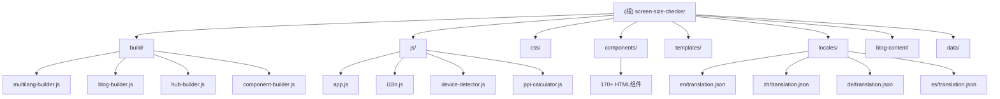

# Screen Size Checker - AI 上下文文档

> 最后更新: 2025-12-29 14:41:32
> 版本: v2.3.0
> 状态: 生产就绪

## 变更记录 (Changelog)

### 2025-12-29 - 初始化 AI 上下文文档
- 创建根级和模块级 CLAUDE.md 文档
- 生成项目架构索引和模块结构图
- 建立 AI 辅助开发的上下文基础

---

## 项目愿景

Screen Size Checker 是一个功能强大的在线工具，旨在帮助开发者和设计师：
- 实时检测屏幕信息（分辨率、视口、DPR）
- 比较设备尺寸和规格
- 测试响应式设计
- 提供专业的技术博客内容

核心价值：
- **多语言支持**: 4种语言完整支持（英文、中文、德语、西班牙语）
- **组件化架构**: 170+个可复用HTML组件
- **静态构建**: 纯静态文件，全球CDN加速
- **SEO优化**: 根域名直接访问，无重定向

---

## 架构总览

### 技术栈
- **前端**: 现代JavaScript (ES6+)、CSS3、i18next国际化
- **构建系统**: Node.js、自定义多语言构建器
- **部署**: Cloudflare Pages、全球CDN
- **内容管理**: Markdown驱动的博客+Hub系统

### 核心架构模式
1. **组件化构建**: 模板+组件→静态页面
2. **多语言生成**: 单一源码→4语言版本
3. **内容驱动**: Markdown→HTML组件→页面
4. **性能优先**: 模块化加载、移动端优化、字体优化

---

## 模块结构图



---

## 模块索引

| 模块路径 | 职责 | 语言 | 入口文件 | 测试 |
|:---------|:-----|:-----|:---------|:-----|
| `build/` | 构建系统：多语言构建、博客生成、组件管理 | JavaScript | multilang-builder.js | ❌ |
| `js/` | 前端逻辑：应用入口、国际化、设备检测、计算器 | JavaScript (ES6+) | app.js | ❌ |
| `css/` | 样式系统：基础样式、响应式、移动端优化 | CSS3 | main.css, base.css | ❌ |
| `components/` | HTML组件：170+个可复用组件 | HTML | (多个组件文件) | ❌ |
| `templates/` | 页面模板：基础模板、博客模板、设备页面模板 | HTML | base.html | ❌ |
| `locales/` | 翻译资源：4语言完整支持 | JSON | en/translation.json | ✅ |
| `blog-content/` | 博客内容：Markdown文章源文件 | Markdown | (多个.md文件) | ❌ |
| `data/` | 配置数据：内链配置 | JSON | internal-links-config.json | ❌ |

---

## 运行与开发

### 环境要求
- Node.js >= 16.0.0
- 现代浏览器（Chrome, Firefox, Safari, Edge）

### 安装依赖
```bash
npm install
```

### 构建命令
```bash
# 生产构建（多语言+博客+Hub）
npm run multilang-build

# 测试组件构建
npm run test-build

# 验证组件完整性
npm run validate-components

# 批量构建所有页面
npm run batch-build
```

### 开发流程
1. 修改组件：`components/` 目录
2. 修改模板：`templates/` 目录
3. 修改翻译：`locales/` 目录
4. 运行构建：`npm run multilang-build`
5. 检查输出：`multilang-build/` 目录

---

## 测试策略

### 当前状态
- **单元测试**: ❌ 未实施
- **集成测试**: ❌ 未实施
- **构建验证**: ✅ 通过构建系统自动验证
- **翻译验证**: ✅ 构建时自动检测缺失翻译

### 建议测试方向
1. 构建系统单元测试（multilang-builder.js）
2. 前端组件集成测试（使用Playwright）
3. 多语言功能测试
4. 响应式设计测试

---

## 编码规范

### JavaScript
- 使用ES6+语法（import/export、箭头函数、async/await）
- 模块化设计，单一职责原则
- 性能优先：延迟加载、防抖节流
- 注释清晰，说明复杂逻辑

### CSS
- 移动优先设计
- 使用CSS变量
- 模块化样式文件
- 响应式断点：768px（平板）、1024px（桌面）

### HTML组件
- 语义化标签
- 支持i18n翻译（data-i18n属性）
- 可复用、独立
- 无内联样式

### 构建系统
- 纯静态输出
- 多语言支持
- 组件化构建
- 自动化验证

---

## AI 使用指引

### 适合 AI 辅助的任务
1. **新增博客文章**: 在`blog-content/`下创建Markdown文件
2. **翻译补全**: 补充`locales/`中的缺失翻译键
3. **组件开发**: 在`components/`下创建新组件
4. **样式优化**: 优化CSS性能和响应式设计
5. **构建脚本增强**: 扩展构建系统功能

### 需要人工审查的任务
1. **架构变更**: 修改核心构建逻辑
2. **SEO配置**: 修改结构化数据和元标签
3. **性能优化**: 涉及关键渲染路径的修改
4. **多语言URL**: 修改路由和重定向规则

### 关键约束
- **不修改已有功能**: 除非明确要求
- **保持向后兼容**: 特别是URL结构
- **遵循现有模式**: 组件、模板、构建流程
- **测试构建**: 每次修改后运行`npm run multilang-build`

### 上下文提示
- 查看`README.md`了解项目全貌
- 查看`BUILD_SYSTEM.md`了解构建细节
- 查看`DEPLOYMENT.md`了解部署流程
- 查看各模块的`CLAUDE.md`了解模块细节

---

## 关键文件路径

### 构建系统
- `F:\LayaAir-GitHub\screen-size-checker\build\multilang-builder.js` - 多语言构建器（2687+行）
- `F:\LayaAir-GitHub\screen-size-checker\build\blog-builder.js` - 博客构建器
- `F:\LayaAir-GitHub\screen-size-checker\build\hub-builder.js` - Hub构建器
- `F:\LayaAir-GitHub\screen-size-checker\build\pages-config.json` - 页面配置（6185+行）

### 前端核心
- `F:\LayaAir-GitHub\screen-size-checker\js\app.js` - 应用入口
- `F:\LayaAir-GitHub\screen-size-checker\js\i18n.js` - 国际化管理
- `F:\LayaAir-GitHub\screen-size-checker\js\device-detector.js` - 设备检测

### 配置文件
- `F:\LayaAir-GitHub\screen-size-checker\package.json` - 项目配置
- `F:\LayaAir-GitHub\screen-size-checker\.gitignore` - Git忽略规则
- `F:\LayaAir-GitHub\screen-size-checker\data\internal-links-config.json` - 内链配置

---

## 项目统计

### 代码规模
- **总页面数**: 180+个页面（4语言）
- **组件数量**: 170+个HTML组件
- **JavaScript模块**: 29个文件
- **CSS样式文件**: 25个文件
- **翻译键值**: 724个（英文）、723个（中文）、709个（德语/西班牙语）
- **博客文章**: 8篇 × 4语言 = 32页
- **Gaming Hub**: 4页 × 4语言 = 16页

### 构建输出
- **英文页面**: 45+个（根路径）
- **中文页面**: 45+个（/zh/）
- **德语页面**: 45+个（/de/）
- **西班牙语页面**: 45+个（/es/）

### 忽略规则
- 构建产物：`multilang-build/`, `test-build/`
- 依赖：`node_modules/`
- 环境文件：`.env`, `.env.local`
- 编辑器文件：`.vscode/`, `.idea/`, `.cursor/`
- 参考文档：`SEMRUSH/`

---

## 下一步建议

### 高优先级
1. 为构建系统添加单元测试
2. 补全预备语言的翻译（法语、意大利语等）
3. 优化移动端性能（已有基础优化）

### 中优先级
1. 添加端到端测试（Playwright）
2. 实施代码质量检查（ESLint）
3. 优化构建速度

### 低优先级
1. 添加更多博客文章
2. 扩展Gaming Hub内容
3. 添加更多设备规格数据
