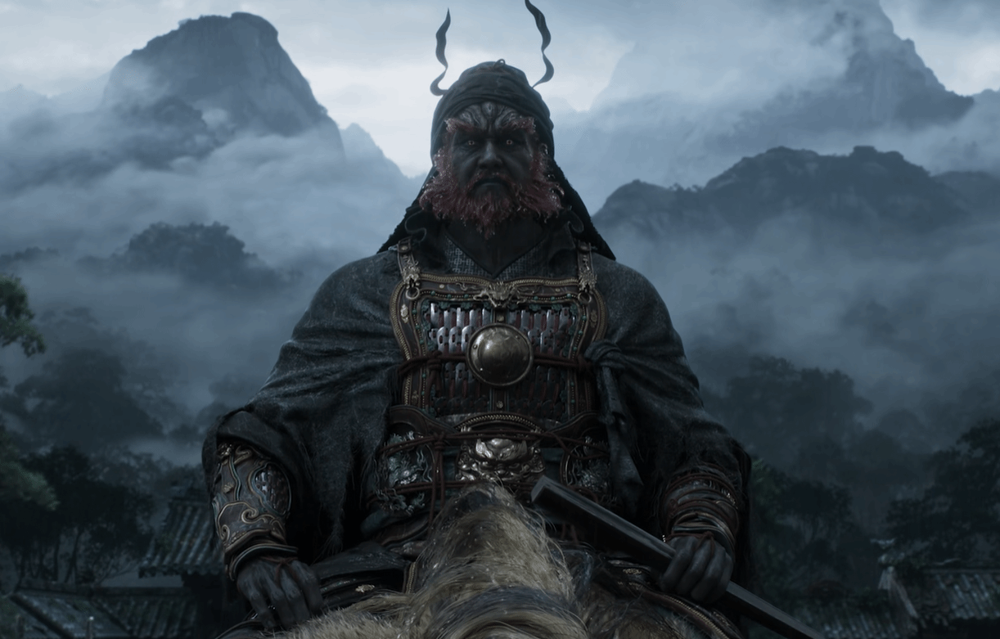

> **注意**: 此文章的德语翻译版本正在准备中。以下是英文原文，翻译工作将很快完成。

# Black Myth: Zhong Kui — Do You Need a New Monitor for the Ultimate 4K Experience?

The gaming world has been set ablaze by the latest trailer for Black Myth: Zhong Kui, and for good reason. Game Science's upcoming masterpiece promises to deliver visuals that blur the line between reality and fantasy, showcasing the raw power of modern game engines in ways that make even seasoned gamers stop in their tracks. But here's the million-dollar question that every excited fan should be asking: is your current monitor actually capable of doing justice to this visual spectacle?

If you've been mesmerized by those jaw-dropping trailer sequences, you're not alone. The intricate details of Zhong Kui's character model, the atmospheric lighting that seems to breathe life into every scene, and the fluid combat animations that flow like poetry in motion—all of these elements combine to create an experience that demands the very best from your display technology. The harsh reality? Your monitor might be the bottleneck standing between you and gaming nirvana.

## Deconstructing the Beauty: Why Zhong Kui's Visuals Are So Demanding

To understand why Black Myth: Zhong Kui is such a visual powerhouse, we need to peek under the hood at the technology driving this experience. Built on Unreal Engine 5, the game leverages cutting-edge rendering techniques that push hardware to its absolute limits.

The magic begins with **ray tracing technology**, which calculates how light bounces off surfaces in real-time, creating reflections, shadows, and global illumination that mirror how light behaves in the real world. When Zhong Kui's ornate armor catches the light, or when shadows dance across ancient temple walls, what you're witnessing is thousands of light rays being traced through the scene every single frame. This isn't just eye candy—it's computational artistry that requires serious horsepower.

Then there's the matter of **ultra-high-resolution textures**. Game Science hasn't held back in creating materials that reveal their intricacies even under close inspection. The weathered stone of ancient structures, the intricate patterns on mystical artifacts, the subtle variations in skin tone and fabric—every surface tells a story through its texture work. These assets can easily consume gigabytes of VRAM and demand substantial bandwidth between your graphics card and monitor.

**DLSS (Deep Learning Super Sampling)** technology enters the equation as both a blessing and a complexity multiplier. While DLSS allows the game to maintain playable framerates at higher resolutions by intelligently upscaling lower-resolution frames, it also introduces considerations about how your monitor handles the upscaled content. The quality of DLSS reconstruction can vary significantly depending on your display's native resolution and processing capabilities.

## Translating Hype to Hardware: Your Monitor is the Final Boss

Here's where many gamers make a critical oversight: they invest thousands in the latest GPU, upgrade their CPU, add more RAM, and optimize their storage—only to route all that computational power through a monitor that was cutting-edge five years ago. Your display isn't just a window to the game world; it's the final rendering stage where all those GPU calculations become the visual experience you actually perceive.

Think of it this way: if your graphics card is a master chef preparing a five-star meal, your monitor is the plate it's served on. Even the most exquisite dish can be ruined by presentation on the wrong tableware. Similarly, all the ray-traced reflections, high-resolution textures, and carefully crafted lighting effects in Black Myth: Zhong Kui can be diminished by a display that can't properly represent the color gamut, contrast ratios, and fine details that the game engine is generating.

The relationship between game engine output and display capability is more nuanced than many realize. Modern games like Black Myth: Zhong Kui are designed with HDR (High Dynamic Range) in mind, capable of producing brightness levels and color depths that far exceed what traditional SDR displays can represent. When you're exploring dimly lit dungeons punctuated by brilliant magical effects, the difference between an HDR-capable display and a standard monitor isn't just noticeable—it's transformational.

## The "Black Myth Ready" Monitor Checklist

### Resolution: The 4K vs. 1440p vs. 1080p Battle

Resolution sits at the heart of the visual experience, and with Black Myth: Zhong Kui, the choice becomes particularly important. The game's asset quality is clearly designed with 4K displays in mind, where every texture detail, every particle effect, and every carefully modeled surface can be appreciated in full glory.

**4K (3840×2160)** represents the current gold standard for gaming displays, offering four times the pixel density of 1080p. When you're examining the intricate details of Zhong Kui's character design or appreciating the subtle environmental storytelling in the game's backgrounds, 4K resolution ensures that no detail is lost to pixelation. However, 4K gaming demands serious graphics horsepower, and even with DLSS assistance, you'll need a high-end GPU to maintain smooth framerates.

**1440p (2560×1440)** strikes a compelling middle ground, offering significantly more detail than 1080p while remaining more accessible in terms of hardware requirements. For many gamers, 1440p represents the sweet spot where visual quality meets performance practicality. The increased pixel density over 1080p makes a noticeable difference in image clarity, particularly in a game with as much fine detail as Black Myth: Zhong Kui.

**1080p (1920×1080)**, while still viable, may leave some of the game's visual splendor on the table. The lower pixel density means that fine details in textures and distant objects may appear softer or less defined than the developers intended. For those interested in exploring the technical differences between these resolutions in greater depth, our [comprehensive resolution comparison guide](https://screensizechecker.com/blog/your-future-4k-vs-1080p-article-url) breaks down the pros and cons of each option.

### Pixel Density (PPI): Seeing Every Single Detail

Pixel density, measured in pixels per inch (PPI), is often the unsung hero of display quality. Two monitors can share the same resolution but deliver vastly different visual experiences based on their pixel density. For Black Myth: Zhong Kui, where fine details matter enormously, understanding PPI becomes crucial.

Higher pixel density means smaller individual pixels, which translates to smoother edges, finer text rendering, and the ability to discern subtle details in game textures. When you're admiring the craftsmanship of an in-game artifact or reading environmental text, higher PPI ensures that pixelation doesn't break the immersion.

The relationship between screen size and resolution determines your effective PPI. A 27-inch 4K monitor delivers approximately 163 PPI, while a 32-inch 4K monitor provides about 138 PPI. Both offer excellent clarity, but the smaller monitor will appear slightly sharper due to the higher pixel density. To calculate the exact PPI for any display configuration you're considering, our [free PPI Calculator](https://screensizechecker.com/devices/ppi-calculator) takes the guesswork out of the equation.

### Aspect Ratio: Widescreen for a Wider World

Black Myth: Zhong Kui's environments are designed to be expansive and immersive, making aspect ratio selection more impactful than you might initially consider. While the traditional 16:9 aspect ratio remains the most common and well-supported option, ultrawide formats offer unique advantages for this type of gaming experience.

**21:9 ultrawide monitors** can provide a more cinematic field of view, allowing you to see more of the game world horizontally without sacrificing vertical space. In exploration-heavy games like Black Myth: Zhong Kui, this expanded view can enhance immersion and provide tactical advantages in combat situations. The wider field of view can make environments feel more grand and expansive, particularly in the game's more scenic outdoor areas.

**16:9 standard widescreen** remains the most universally supported option, ensuring compatibility with all game content and UI elements. Most games, including Black Myth: Zhong Kui, are primarily designed and tested with 16:9 in mind, guaranteeing that you'll experience the game exactly as the developers intended.

For gamers considering different aspect ratios or curious about how various screen dimensions translate to real-world viewing experiences, our [Aspect Ratio Calculator](https://screensizechecker.com/devices/aspect-ratio-calculator) provides detailed comparisons and recommendations.

### Bonus: Refresh Rate & Response Time

While Black Myth: Zhong Kui isn't primarily a competitive esports title, refresh rate and response time still play important roles in the overall experience. Higher refresh rates (120Hz, 144Hz, or beyond) can make camera movements and combat animations appear smoother and more fluid, particularly during fast-paced action sequences.

**Refresh rate** determines how many times per second your monitor can display a new image. While 60Hz remains perfectly playable for single-player adventures, higher refresh rates can enhance the sense of smoothness and responsiveness, particularly if your hardware can maintain framerates that take advantage of the increased refresh capability.

**Response time** measures how quickly pixels can change from one color to another. Lower response times reduce motion blur and ghosting, which can be particularly noticeable during rapid camera movements or fast-paced combat scenarios. For gaming, response times under 5ms are generally considered excellent, while anything under 1ms represents the current pinnacle of display responsiveness.

## Conclusion: Are You Ready for the Journey?

Black Myth: Zhong Kui represents more than just another game release—it's a showcase of what's possible when cutting-edge game development meets modern display technology. The visual feast that Game Science has crafted deserves to be experienced in all its glory, and your monitor choice will ultimately determine whether you're seeing the complete picture or settling for a diminished version of the developers' vision.

The investment in a quality display isn't just about this single game; it's about future-proofing your setup for the next generation of visually stunning titles that will undoubtedly follow in Zhong Kui's footsteps. Whether you choose 4K for maximum detail, 1440p for balanced performance, or explore ultrawide options for enhanced immersion, the key is making an informed decision based on your hardware capabilities and gaming preferences.

Before making that monitor upgrade decision, take advantage of our comprehensive [free Screen Size Checker tool](https://screensizechecker.com/) to visualize exactly how different display sizes and resolutions will look in your gaming space. Sometimes the difference between a good gaming experience and a great one comes down to choosing the right canvas for the masterpiece.

The age of truly cinematic gaming is here, and Black Myth: Zhong Kui is leading the charge. The question isn't whether you'll play this visual masterpiece—it's whether your display is ready to do it justice.
