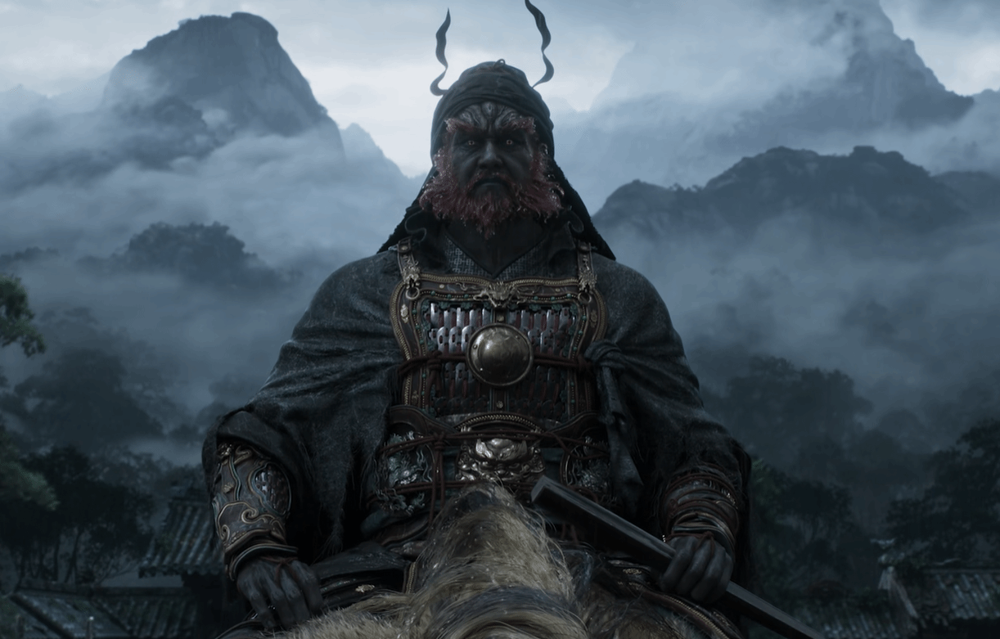

# Black Myth: Zhong Kui – Brauchen Sie einen neuen 4K-Monitor?

Black Myth: Zhong Kui ist genau die Art Spiel, bei der ein guter Monitor einen sichtbaren Unterschied macht. Wenn Sie nur auf GPU und CPU schauen, aber das Bild am Ende auf einem älteren oder schlecht abgestimmten Display landet, verschenken Sie einen Teil der eigentlichen Spielerfahrung.

**Kurzantwort**: Für Black Myth lohnt sich 2026 vor allem ein Monitor mit **1440p oder 4K**, guter **HDR-Unterstützung**, sinnvoller **Bildwiederholrate** und sauberer **Pixeldichte**. Für viele Spieler ist **27 Zoll bei 1440p** oder **27–32 Zoll bei 4K** die sinnvollste Kombination.

## Warum das Spiel so hohe Anforderungen an Displays stellt

Titel wie Black Myth profitieren besonders von:

- feinen Texturen
- hohem Kontrast in dunklen Szenen
- hellen Magie- und Partikeleffekten
- sauberer Darstellung bei schnellen Kamerabewegungen

Wenn Ihr Monitor bei Helligkeit, Schärfe oder Reaktionszeit schwächelt, wirkt das Spiel schnell flacher als es eigentlich ist.

## Welche Auflösung sinnvoll ist

### 1080p

1080p bleibt spielbar, ist aber für ein visuell aufwendiges Spiel eher die Untergrenze. Feine Details und weiter entfernte Objekte wirken schneller weich oder unruhig.

### 1440p

Für viele ist **1440p** der beste Sweet Spot. Sie bekommen deutlich mehr Schärfe als bei 1080p, ohne dass die Hardware-Belastung so stark anzieht wie bei 4K.

### 4K

Wenn Sie die Grafikqualität maximal ausreizen möchten, ist **4K** die stärkste Wahl. Voraussetzung ist allerdings, dass Ihre GPU und Ihr restliches System stabile Bildraten liefern können.

Mehr zum Thema: [Beste Gaming-Auflösung 2026]({{lang_prefix}}/hub/best-gaming-resolution-2025)

## PPI und Monitorgröße nicht vergessen

Auflösung allein reicht nicht. Wichtig ist auch die Kombination mit der Bildschirmgröße:

- **27 Zoll / 1440p** = sehr guter Schärfe- und Performance-Mix
- **27 Zoll / 4K** = extrem scharf, ideal für Detailfans
- **32 Zoll / 4K** = immersiver, aber etwas geringere Pixeldichte als bei 27 Zoll

Wenn Sie Ihre Konfiguration prüfen möchten, nutzen Sie unseren [PPI-Rechner]({{lang_prefix}}/devices/ppi-calculator).

## HDR, Bildwiederholrate und Reaktionszeit

### HDR

Wenn Ihr Monitor echtes brauchbares HDR unterstützt, profitieren besonders:
- dunkle Umgebungen
- helle Magieeffekte
- Kontrast in Zwischensequenzen

### Bildwiederholrate

Auch wenn Black Myth kein klassischer E-Sport-Titel ist, fühlt sich das Spiel auf **120Hz oder 144Hz** oft deutlich geschmeidiger an als auf 60Hz.

### Reaktionszeit

Niedrigere Reaktionszeiten helfen gegen Schlieren und Bewegungsunschärfe, vor allem in schnellen Kämpfen oder bei Kameraschwenks.

## Welche Monitorkombinationen sich 2026 am meisten lohnen

Je nach Setup sind diese Varianten am sinnvollsten:

- **Budget / solide**: 27 Zoll, 1440p, 120–144Hz
- **High-End / Singleplayer-Fokus**: 27–32 Zoll, 4K, HDR
- **Immersion / Ultrawide-Fans**: 21:9 mit guter GPU-Leistung

Wenn Sie zusätzlich Seitenverhältnisse vergleichen wollen, hilft unser [Aspect Ratio Calculator]({{lang_prefix}}/devices/aspect-ratio-calculator).

## Fazit

Für Black Myth: Zhong Kui brauchen Sie nicht zwingend sofort einen neuen Monitor – aber wenn Ihr aktuelles Display alt, dunkel, langsam oder nur mittelmäßig scharf ist, wird genau das zum Flaschenhals.

Für die meisten Spieler ist 2026 ein **27-Zoll-1440p-Monitor** die beste Balance. Wenn Ihre Hardware stark genug ist und Sie das Maximum aus den Visuals holen wollen, lohnt sich **4K** definitiv.

---

## Weiterführende Links

- [Beste Gaming-Auflösung 2026]({{lang_prefix}}/hub/best-gaming-resolution-2025)
- [PPI-Rechner]({{lang_prefix}}/devices/ppi-calculator)
- [Aspect Ratio Calculator]({{lang_prefix}}/devices/aspect-ratio-calculator)
- [Gaming-Monitor-Setup 2026]({{lang_prefix}}/blog/gaming-monitor-setup-guide)

---

*Zuletzt aktualisiert: März 2026*
